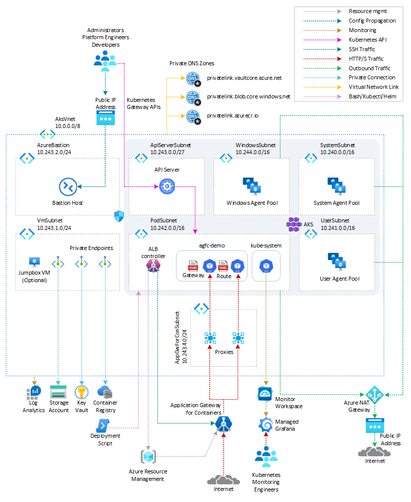
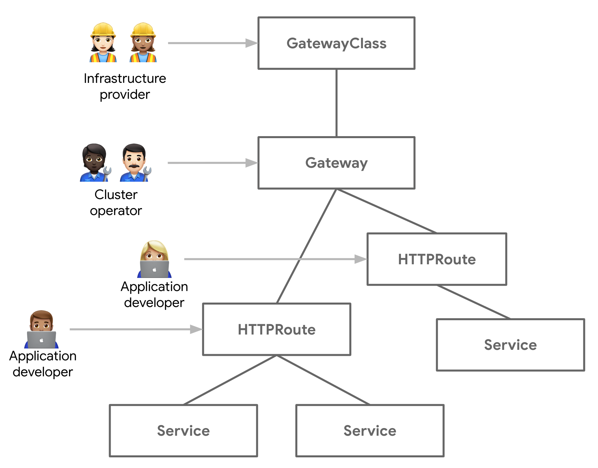
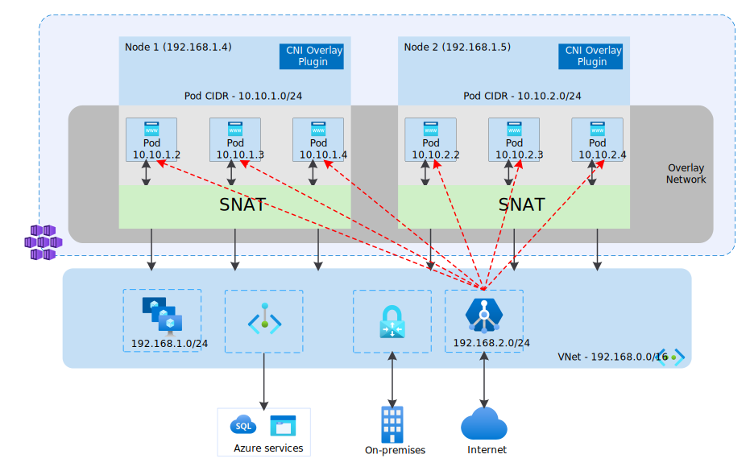
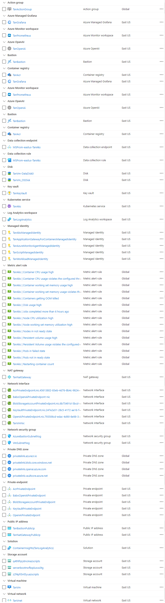
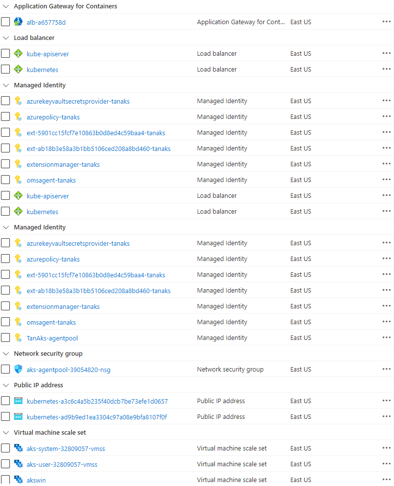
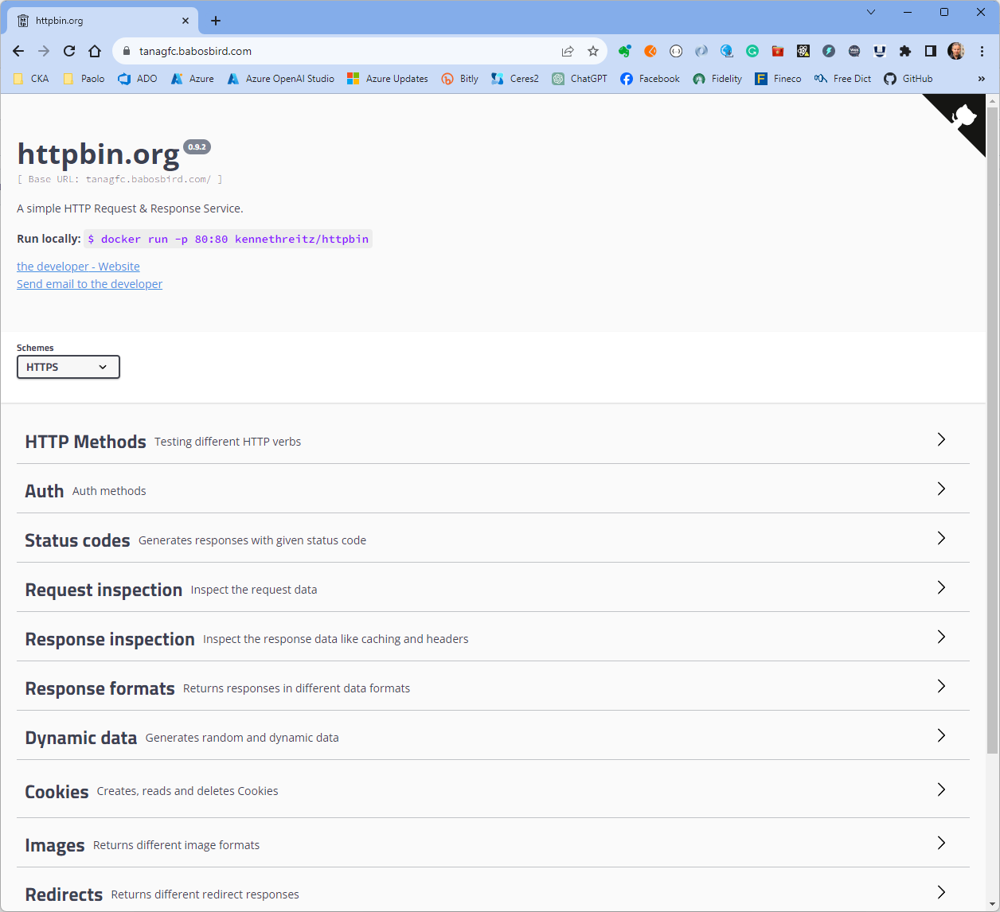

# Deploying Azure Kubernetes Service (AKS) with Azure CNI Overlay and Application Gateway for Containers

The [Application Gateway for Containers](https://learn.microsoft.com/azure/application-gateway/for-containers/overview) is a next-generation, application layer that offers load balancing and dynamic traffic management for applications running in a Kubernetes cluster. As part of Azure's Application Load Balancing portfolio, this innovative product provides an enhanced experience for developers and administrators. The Application Gateway for Containers represents the evolution of the [Application Gateway Ingress Controller (AGIC)](https://learn.microsoft.com/azure/application-gateway/ingress-controller-overview) and enables Azure Kubernetes Service (AKS) customers to leverage Azure's native Application Gateway load balancer.

In this article, you will learn how to deploy an [Azure Kubernetes Service(AKS)](https://docs.microsoft.com/azure/aks/intro-kubernetes) cluster, configured to use [Azure CNI Overlay](https://learn.microsoft.com/azure/aks/azure-cni-overlay?tabs=kubectl), and [Application Gateway for Containers](https://learn.microsoft.com/azure/application-gateway/for-containers/overview) in a fully-automated fashion, using either a bring your own (BYO) or managed by ALB deployment. In addition, you will learn how to expose a workload using the [Gateway API](https://gateway-api.sigs.k8s.io/) via the [Application Gateway for Containers](https://learn.microsoft.com/azure/application-gateway/for-containers/overview) and how to configure [cert-manager](https://cert-manager.io/docs/usage/gateway/) to generate a TLS certificate for the Gateway resource.

## Prerequisites

- An active [Azure subscription](https://docs.microsoft.com/azure/guides/developer/azure-developer-guide#understanding-accounts-subscriptions-and-billing). If you don't have one, create a [free Azure account](https://azure.microsoft.com/free/) before you begin.
- The **Owner** [Azure built-in role](https://learn.microsoft.com/azure/role-based-access-control/built-in-roles), or the **User Access Administrator** and **Contributor** built-in roles, on a subscription in your Azure account.
- [Azure CLI](https://learn.microsoft.com/cli/azure/install-azure-cli) version 2.61.0 or later. For more information, see [Install Azure CLI](https://learn.microsoft.com/cli/azure/install-azure-cli).
- [Azure Kubernetes Service (AKS) preview extension](https://learn.microsoft.com/azure/aks/draft#install-the-aks-preview-azure-cli-extension).
- [jq](https://jqlang.github.io/jq/) version 1.5 or later.
- [Python 3](https://www.python.org/downloads/) or later.
- [kubectl](https://kubernetes.io/docs/tasks/tools/install-kubectl/) version 1.21.0 or later
- [Helm](https://helm.sh/docs/intro/install/) version 3.0.0 or later
- [Visual Studio Code](https://code.visualstudio.com/) installed on one of the [supported platforms](https://code.visualstudio.com/docs/supporting/requirements#_platforms) along with the [Bicep extension](https://marketplace.visualstudio.com/items?itemName=ms-azuretools.vscode-bicep).
- An existing [Azure Key Vault](https://learn.microsoft.com/azure/key-vault/general/overview) resource with a valid TLS certificate for the Yelb web application.
- An existing [Azure DNS Zone](https://learn.microsoft.com/azure/dns/dns-zones-records) or equivalent DNS server for the name resolution of the [Yelb](https://github.com/mreferre/yelb/) application.
- `aks-preview` Azure CLI extension

## Architecture

This sample provides a comprehensive set of Bicep modules that facilitate the deployment of an [Azure Kubernetes Service (AKS)](https://docs.microsoft.com/azure/aks/intro-kubernetes) cluster with an integrated [Application Gateway for Containers](https://learn.microsoft.com/azure/application-gateway/for-containers/overview). Additionally, it offers modules for the optional deployment of other essential Azure services, including the [Azure Monitor managed service for Prometheus](https://learn.microsoft.com/azure/azure-monitor/essentials/prometheus-metrics-overview) resource and an [Azure Managed Grafana](https://learn.microsoft.com/azure/managed-grafana/overview) instance for efficient monitoring of the cluster's performance and overall health status.

The following diagram illustrates the architecture and network topology implemented by this sample



### Extensions and Features

Bicep modules are parametric, so that you can choose any network plugin. In addition, this sample shows how to deploy an [Azure Kubernetes Service](https://docs.microsoft.com/azure/aks/intro-kubernetes) cluster with the following extensions and features:

| **Name** | **Description** |
|----------|-----------------|
| [Istio-based service mesh add-on for Azure Kubernetes Service](https://learn.microsoft.com/azure/aks/istio-about) | Provides an officially supported and tested [Istio](https://istio.io/v1.1/docs/concepts/what-is-istio/) integration for Azure Kubernetes Service (AKS). |
| [API Server VNET Integration](https://learn.microsoft.com/azure/aks/api-server-vnet-integration) | Allows you to enable network communication between the API server and the cluster nodes without requiring a private link or tunnel. AKS clusters with API Server VNET integration provide a series of advantages, for example, they can have public network access or private cluster mode enabled or disabled without redeploying the cluster. For more information, see [Create an Azure Kubernetes Service cluster with API Server VNet Integration](https://learn.microsoft.com/azure/aks/api-server-vnet-integration). |
| [Azure NAT Gateway](https://learn.microsoft.com/azure/virtual-network/nat-gateway/nat-overview) | To manage outbound connections initiated by AKS-hosted workloads. |
| [Event-driven Autoscaling (KEDA) add-on](https://learn.microsoft.com/azure/aks/keda-about) | A single-purpose and lightweight component that strives to make application autoscaling simple and is a CNCF Incubation project. |
| [Dapr extension for Azure Kubernetes Service (AKS)](https://learn.microsoft.com/azure/aks/dapr) | Allows you to install [Dapr](https://dapr.io/), a portable, event-driven runtime that simplifies building resilient, stateless, and stateful applications that run on the cloud and edge and embrace the diversity of languages and developer frameworks. With its sidecar architecture, Dapr helps you tackle the challenges that come with building microservices and keeps your code platform agnostic. |
| [Flux V2 extension](https://learn.microsoft.com/azure/azure-arc/kubernetes/tutorial-use-gitops-flux2?tabs=azure-cli) | Allows to deploy workloads to an Azure Kubernetes Service (AKS) cluster via [GitOps](https://www.weave.works/technologies/gitops/). For more information, see [GitOps Flux v2 configurations with AKS and Azure Arc-enabled Kubernetes](https://learn.microsoft.com/azure/azure-arc/kubernetes/conceptual-gitops-flux2). |
| [Vertical Pod Autoscaling](https://learn.microsoft.com/azure/aks/vertical-pod-autoscaler) | Allows you to automatically sets resource requests and limits on containers per workload based on past usage. VPA makes certain pods are scheduled onto nodes that have the required CPU and memory resources. For more information, see [Kubernetes Vertical Pod Autoscaling](https://itnext.io/k8s-vertical-pod-autoscaling-fd9e602cbf81). |
| [Azure Key Vault Provider for Secrets Store CSI Driver](https://learn.microsoft.com/azure/aks/csi-secrets-store-identity-access) | Provides a variety of methods of identity-based access to your [Azure Key Vault](https://learn.microsoft.com/azure/key-vault/general/overview). |
| [Image Cleaner](https://learn.microsoft.com/azure/aks/image-cleaner?tabs=azure-cli) | To clean up stale images on your Azure Kubernetes Service cluster. |
| [Azure Kubernetes Service (AKS) Network Observability](https://learn.microsoft.com/azure/aks/network-observability-overview) | Is an important part of maintaining a healthy and performant Kubernetes cluster. By collecting and analyzing data about network traffic, you can gain insights into how your cluster is operating and identify potential problems before they cause outages or performance degradation. |
| [Windows Server node pool](https://learn.microsoft.com/azure/aks/create-node-pools#windows-server-node-pools-with-containerd) | Allows running [Windows Server containers on an Azure Kubernetes Service (AKS) cluster](https://learn.microsoft.com/azure/aks/learn/quick-windows-container-deploy-cli). You can disable the deployment of a Windows node pool. |

### Azure Resources

The Bicep modules deploy or use the following Azure resources:

| Resource | Type | Description |
|----------|------|-------------|
| [Azure Kubernetes Service(AKS)](https://docs.microsoft.com/azure/aks/intro-kubernetes) | [Microsoft.ContainerService/managedClusters](https://learn.microsoft.com/azure/templates/microsoft.containerservice/managedclusters?pivots=deployment-language-bicep) | A public or private AKS cluster composed of a `system` node pool in a dedicated subnet that hosts only critical system pods and services, and a `user` node pool hosting user workloads and artifacts in a dedicated subnet. |
| [Application Gateway for Containers](https://learn.microsoft.com/azure/application-gateway/for-containers/overview) | [Microsoft.Network/applicationGateways](https://learn.microsoft.com/azure/templates/microsoft.network/applicationgateways?pivots=deployment-language-bicep) | A fully managed regional layer 7 load balancer and service proxy used to expose AKS-hosted workloads.  |
| [Grafana Admin Role Assignment](https://learn.microsoft.com/azure/managed-grafana/how-to-share-grafana-workspace?tabs=azure-portal) | [Microsoft.Authorization/roleDefinitions](https://learn.microsoft.com/azure/templates/microsoft.authorization/roleassignments?pivots=deployment-language-bicep) | A `Grafana Admin` role assignment on the Azure Managed Grafana for the Microsoft Entra ID user whose objectID is defined in the `userId` parameter. |
| [Key Vault Administrator Role Assignment](https://learn.microsoft.com/azure/aks/csi-secrets-store-driver) | [Microsoft.Authorization/roleDefinitions](https://learn.microsoft.com/azure/templates/microsoft.authorization/roleassignments?pivots=deployment-language-bicep) | A `Key Vault Administrator` role assignment on the existing Azure Key Vault resource which contains the TLS certificate for the user-defined managed identity used by the Azure Key Vault provider for Secrets Store CSI Driver. |
| [Azure DNS Zone](https://learn.microsoft.com/azure/dns/private-dns-overview) | [Microsoft.Network/dnsZones](https://learn.microsoft.com/azure/templates/microsoft.network/dnszones?pivots=deployment-language-bicep) | An existing Azure DNS zone used for the name resolution of AKS-hosted workloads. This resource is optional. |
| [Virtual Network](https://docs.microsoft.com/azure/virtual-network/virtual-networks-overview) | [Microsoft.Network/virtualNetworks](https://docs.microsoft.com/azure/templates/microsoft.network/virtualnetworks) | A new virtual network with multiple subnets for different purposes: `SystemSubnet`is used for the agent nodes of the `system` node pool, `UserSubnet` is used for the agent nodes of the `user` node pool, `ApiServerSubnet` is used by API Server VNET Integration, `AzureBastionSubnet` is used by Azure Bastion Host, `VmSubnet` is used for a jump-box virtual machine used to connect to the (private) AKS cluster and for Azure Private Endpoints, `AppGwForConSubnet` hosts the proxies created by the `Application Load Balancer` control plane to handle and distribute the ingress traffic to the AKS-hosted pods. |
| [User-Assigned Managed Identity](https://docs.microsoft.com/azure/active-directory/managed-identities-azure-resources/overview) | [Microsoft.ManagedIdentity/userAssignedIdentities](https://learn.microsoft.com/azure/templates/microsoft.managedidentity/2018-11-30/userassignedidentities?pivots=deployment-language-bicep) | A user-defined managed identity used by the AKS cluster to create additional resources in Azure. |
| [Virtual Machine](https://docs.microsoft.com/azure/virtual-machines/windows/) | [Microsoft.Compute/virtualMachines](https://docs.microsoft.com/azure/templates/microsoft.compute/virtualmachines) | A jump-box virtual machine used to manage the private AKS cluster. |
| [Azure Bastion](https://docs.microsoft.com/azure/bastion/bastion-overview) | [Microsoft.Network/bastionHosts](https://docs.microsoft.com/azure/templates/microsoft.network/bastionhosts) | An Azure Bastion deployed in the AKS cluster virtual network to provide SSH connectivity to agent nodes and virtual machines. |
| [Storage Account](https://docs.microsoft.com/azure/storage/common/storage-account-overview) | [Microsoft.Storage/storageAccounts](https://docs.microsoft.com/azure/templates/microsoft.storage/storageaccounts) | A storage account used to store the boot diagnostics logs of the jumpbox virtual machine. |
| [Azure Container Registry](https://docs.microsoft.com/azure/container-registry/container-registry-intro) | [Microsoft.ContainerRegistry/registries](https://learn.microsoft.com/azure/templates/microsoft.containerregistry/registries?pivots=deployment-language-bicep) | An Azure Container Registry to build, store, and manage container images and artifacts in a private registry. This is not required to deploy the `Yelb` application as the sample uses public container images. |
| [Azure Key Vault](https://docs.microsoft.com/azure/key-vault/general/basic-concepts) | [Microsoft.KeyVault/vaults](https://learn.microsoft.com/azure/templates/microsoft.keyvault/vaults?pivots=deployment-language-bicep) | An existing Azure Key Vault used to store secrets, certificates, and keys. |
| [Azure Private Endpoint](https://learn.microsoft.com/azure/private-link/private-endpoint-overview)| [Microsoft.Network/privateEndpoints](https://docs.microsoft.com/azure/templates/microsoft.network/privateendpoints) | Azure Private Endpoints for Azure Container Registry, Azure Key Vault, and Azure Storage Account. |
| [Azure Private DNS Zone](https://docs.microsoft.com/azure/dns/private-dns-overview) | [Microsoft.Network/privateDnsZones](https://docs.microsoft.com/azure/templates/microsoft.network/privatednszones) |  Azure Private DNS Zones are used for the DNS resolution of the Azure Private Endpoints for Azure Container Registry, Azure Key Vault, Azure Storage Account, API Server when deploying a private AKS cluster. |
| [Azure Network Security Group](https://docs.microsoft.com/azure/virtual-network/network-security-groups-overview) | [Microsoft.Network/networkSecurityGroups](https://docs.microsoft.com/azure/templates/microsoft.network/networksecuritygroups?tabs=bicep) | Azure Network Security Groups used to filter inbound and outbound traffic for subnets hosting virtual machines. |
| [Azure Monitor Workspace](https://learn.microsoft.com/azure/azure-monitor/essentials/azure-monitor-workspace-overview) | [Microsoft.Monitor/accounts](https://learn.microsoft.com/azure/azure-monitor/essentials/azure-monitor-workspace-overview) | An [Azure Monitor workspace](https://learn.microsoft.com/azure/azure-monitor/essentials/azure-monitor-workspace-overview) to store Prometheus metrics generated by the AKS cluster and workloads.You can [Prometheus query language (PromQL)](https://aka.ms/azureprometheus-promio-promql) to analyze and alert on the performance of monitored infrastructure and workloads without having to operate the underlying infrastructure. The primary method for visualizing Prometheus metrics is [Azure Managed Grafana](https://learn.microsoft.com/azure/managed-grafana/overview). |
| [Azure Managed Grafana](https://learn.microsoft.com/azure/managed-grafana/overview) | [Microsoft.Dashboard/grafana](https://learn.microsoft.com/azure/templates/microsoft.dashboard/grafana?pivots=deployment-language-bicep) | an [Azure Managed Grafana](https://learn.microsoft.com/azure/managed-grafana/overview) instance used to visualize the [Prometheus metrics](https://learn.microsoft.com/azure/azure-monitor/containers/prometheus-metrics-enable?tabs=azure-portal) generated by the [Azure Kubernetes Service(AKS)](https://docs.microsoft.com/azure/aks/intro-kubernetes) cluster. [Azure Managed Grafana](https://learn.microsoft.com/azure/managed-grafana/overview) provides a set of built-in dashboards to visualize Prometheus metrics generated by your AKS cluster and workloads. |
| [Azure Log Analytics Workspace](https://docs.microsoft.com/azure/azure-monitor/logs/log-analytics-workspace-overview) | [Microsoft.OperationalInsights/workspaces](https://docs.microsoft.com/azure/templates/microsoft.operationalinsights/workspaces) | A centralized Azure Log Analytics workspace used to collect diagnostics logs and metrics from managed Azure resources. |
| [Deployment Script](https://learn.microsoft.com/azure/azure-resource-manager/bicep/deployment-script-bicep) | [Microsoft.Resources/deploymentScripts](https://learn.microsoft.com/azure/templates/microsoft.resources/deploymentscripts?pivots=deployment-language-bicep) | a deployment script is used to run the `install-alb-controller-overlay.sh` Bash script that creates the Application Load Balancer (ALB) Controller via [Helm](https://helm.sh/) along with [Cert-Manager](https://cert-manager.io/docs/)[Prometheus](https://prometheus.io/), and [Grafana](https://grafana.com) to the AKS cluster using [Helm](https://helm.sh/). However, the in-cluster Prometheus and Grafana instances are not necessary as the Bicep modules install [Azure Managed Prometheus](https://learn.microsoft.com/azure/azure-monitor/essentials/azure-monitor-workspace-overview) and [Azure Managed Grafana](https://learn.microsoft.com/azure/managed-grafana/overview) to collect and monitor AKS Prometheus metrics. For more details on deployment scripts, refer to the [Use deployment scripts in Bicep](https://learn.microsoft.com/azure/azure-resource-manager/bicep/deployment-script-bicep) documentation.|

In a production environment, we strongly recommend deploying a [private AKS cluster](https://docs.microsoft.com/azure/aks/private-clusters) with [Uptime SLA](https://docs.microsoft.com/azure/aks/uptime-sla). For more information, see [private AKS cluster with a Public DNS address](https://docs.microsoft.com/azure/aks/private-clusters#create-a-private-aks-cluster-with-a-public-dns-address). Alternatively, you can deploy a public AKS cluster and secure access to the API server using [authorized IP address ranges](https://learn.microsoft.com/azure/aks/api-server-authorized-ip-ranges).

The Bicep modules provide the flexibility to selectively deploy the following Azure resources based on your requirements:

> **NOTE**  
> You can find the `architecture.vsdx` file used for the diagram under the `visio` folder.

## What is Gateway API?

The [Ingress resources](https://kubernetes.io/docs/concepts/services-networking/ingress/) Kubernetes objects have evolved into the more comprehensive and powerful Kubernetes [Gateway API](https://gateway-api.sigs.k8s.io/). [Ingress Controller](https://kubernetes.io/docs/concepts/services-networking/ingress-controllers/) and [Gateway API](https://gateway-api.sigs.k8s.io/) are both Kubernetes objects used for managing traffic routing and load balancing. While [Ingress Controller](https://kubernetes.io/docs/concepts/services-networking/ingress-controllers/) served as entry points for external traffic, they had limitations in terms of flexibility and extensibility. The Kubernetes [Gateway API](https://gateway-api.sigs.k8s.io/) emerged as a solution to address these limitations. The Designed to be generic, expressive, extensible, and role-oriented, the Gateway API is a modern set of APIs for defining L4 and L7 routing rules in Kubernetes.



Gateway API offers superior functionality compared to Ingress Controllers as it separates listeners and routes into separate Kubernetes objects, `Gateway` and `HTTPRoute`. This separation allows different individuals with distinct roles and permissions to deploy them in separate namespaces. Additionally, Gateway API provides advanced traffic management capabilities including layer 7 HTTP/HTTPS request forwarding based on criteria such as hostname, path, headers, query string, methods, and ports. It also offers SSL termination and TLS policies for secure traffic management. These features grant better control and customization of traffic routing. The design of the Gateway API was driven by the following design goals to address and resolve issues and limitations in ingress controllers:

- **Role-oriented**: The Gateway API is composed of API resources that model organizational roles involved in using and configuring Kubernetes service networking.
- **Portable**: Similar to Ingress, the Gateway API is designed to be a portable specification supported by multiple implementations.
- **Expressive**: The Gateway API resources support core functionality such as header-based matching, traffic weighting, and other capabilities that were previously only possible through custom annotations in Ingress.
- **Extensible**: The Gateway API allows for the linking of custom resources at different layers of the API, enabling granular customization within the API structure.

Additional notable capabilities of the Gateway API include:

- **GatewayClasses**: Formalizes types of load balancing implementations, making it easier for users to understand available capabilities through the Kubernetes resource model.
- **Shared Gateways and cross-Namespace support**: Allows multiple Route resources to attach to the same Gateway, enabling load balancer and VIP sharing among teams and across Namespaces without direct coordination.
- **Typed Routes and typed backends**: The Gateway API supports typed Route resources and different types of backends, providing flexibility in supporting various protocols (HTTP, gRPC) and backend targets (Kubernetes Services, storage buckets, functions).
- Experimental **Service mesh support** with the GAMMA initiative: The Gateway API enables the association of routing resources with Service resources, allowing configuration of service meshes and ingress controllers.

## When to Choose Ingress Controllers or Gateway API

[Ingress resources](https://kubernetes.io/docs/concepts/services-networking/ingress/) are suitable for certain use cases:

- Ingress Controllers are a straightforward option for setting up and are well-suited for smaller and less complex Kubernetes deployments that prioritize easy configuration.
- If you currently have Ingress controllers configured in your Kubernetes cluster and they meet your requirements effectively, there may not be an immediate necessity to transition to the Kubernetes Gateway API.

[Gateway API](https://gateway-api.sigs.k8s.io/) is the recommended option in the following situations:

- When dealing with complex routing configurations, traffic splitting, and advanced traffic management strategies, the flexibility provided by Kubernetes Gateway API's Route resources is essential.
- In cases where networking requirements call for custom solutions or the integration of third-party plugins, the Kubernetes Gateway API's CRD-based approach offers enhanced extensibility.

## What is Application Gateway for Containers?

The [Application Gateway for Containers](https://learn.microsoft.com/azure/application-gateway/for-containers/overview) is a new cutting-edge Azure service that offers load balancing and dynamic traffic management for applications running in a Kubernetes cluster. As part of Azure's Application Load Balancing portfolio, this innovative product provides an enhanced experience for developers and administrators. The Application Gateway for Containers represents the evolution of the [Application Gateway Ingress Controller (AGIC)](https://learn.microsoft.com/azure/application-gateway/ingress-controller-overview) and enables Azure Kubernetes Service (AKS) customers to leverage Azure's native Application Gateway load balancer. Azure Application Gateway for Containers enables you to host multiple web applications on the same port, utilizing unique backend services. This allows for efficient multi-site hosting and simplifies the management of your containerized applications. The Application Gateway for Containers fully supports both the [Gateway API](https://gateway-api.sigs.k8s.io/) and [Ingress API](https://kubernetes.io/docs/concepts/services-networking/ingress/) Kubernetes objects for traffic load balancing.

For more information, see:

- [What is Application Gateway for Containers?](https://learn.microsoft.com/azure/application-gateway/for-containers/overview)
- [Application Gateway for Containers components](https://learn.microsoft.com/azure/application-gateway/for-containers/application-gateway-for-containers-components)
- [Migrate from Application Gateway Ingress Controller (AGIC) to Application Gateway for Containers](https://learn.microsoft.com/azure/application-gateway/for-containers/migrate-from-agic-to-agc)
- [Container networking with Application Gateway for Containers](https://learn.microsoft.com/azure/application-gateway/for-containers/container-networking)
- [gRPC on Application Gateway for Containers](https://learn.microsoft.com/azure/application-gateway/for-containers/grpc)
- [Quickstart: Deploy Application Gateway for Containers ALB Controller](https://learn.microsoft.com/azure/application-gateway/for-containers/quickstart-deploy-application-gateway-for-containers-alb-controller?tabs=install-helm-windows)
- [Quickstart: Create Application Gateway for Containers - Bring your own deployment](https://learn.microsoft.com/azure/application-gateway/for-containers/quickstart-create-application-gateway-for-containers-byo-deployment?tabs=existing-vnet-subnet)
- [Quickstart: Create Application Gateway for Containers managed by ALB Controller](https://learn.microsoft.com/azure/application-gateway/for-containers/quickstart-create-application-gateway-for-containers-managed-by-alb-controller?tabs=new-subnet-aks-vnet)

### Deployment Strategies

Azure Application Gateway for Containers supports two main deployment strategies:

- **Bring your own (BYO) deployment**: If you choose this strategy, the Bicep module creates the Application Gateway for Containers resource in the target deployment resource group. In this case, you are responsible to create [Association](https://learn.microsoft.com/azure/application-gateway/for-containers/application-gateway-for-containers-components#application-gateway-for-containers-associations) and [Frontend](https://learn.microsoft.com/azure/application-gateway/for-containers/application-gateway-for-containers-components#application-gateway-for-containers-frontends) child resources for the Application Gateway for Containers using the Azure Portal, Bicep, Azure CLI, Terraform, or Azure REST API. Every time you want to create a new [Gateway](https://gateway-api.sigs.k8s.io/concepts/api-overview/#gateway) or an [Ingress](https://kubernetes.io/docs/concepts/services-networking/ingress/) object in your Azure Kubernetes Service (AKS) cluster, it's your responsibility to provision a [Frontend](https://learn.microsoft.com/azure/application-gateway/for-containers/application-gateway-for-containers-components#application-gateway-for-containers-frontends) child resource for the Application Gateway for Containers upfront and reference it in the annotations in the Gateway or Ingress object. You are also responsible for deleting any Frontend child resource after deleting a Gateway or Ingress object in Kubernetes.
- **Managed by the Application Load Balancer (ALB) Controller**: In this deployment strategy Azure Load Balancer (ALB) Controller deployed in AKS using an Helm chart by the deployment script is responsible for the lifecycle of the Application Gateway for Containers resource and its sub resources. The ALB Controller creates Application Gateway for Containers resource in the  AKS node resource group when an `ApplicationLoadBalancer` Kubernetes object is defined on the cluster. Every time you want to create a new [Gateway](https://gateway-api.sigs.k8s.io/concepts/api-overview/#gateway) or an [Ingress](https://kubernetes.io/docs/concepts/services-networking/ingress/) object which references the `ApplicationLoadBalancer` Kubernetes object in the annotations, the ALB Controller provisions a new Frontend resource and manage its lifecycle based on the lifecycle of the Gateway or Ingress object.

### Application Gateway for Containers Components

The components of Azure Application Gateway for Containers include:

- **Core Components**: Application Gateway for Containers is a parent Azure resource that manages the control plane, which handles the configuration and orchestration of proxies based on customer requirements. It serves as the parent resource for two important child resources: associations and frontends. These child resources are unique to each Application Gateway for Containers and cannot be shared with other instances of Application Gateway for Containers.
- **Frontend**: An Application Gateway for Containers frontend is a sub-resource of the parent Application Gateway for Containers in Azure. It acts as the entry point for client traffic directed towards a specific Application Gateway for Containers. Each frontend is unique and cannot be associated with multiple Application Gateway for Containers. It provides a unique fully qualified domain name (FQDN) that can be assigned to a customer's CNAME record. Currently, private IP addresses are not supported for frontends. Additionally, a single Application Gateway for Containers has the ability to support multiple frontends.
- **Association**: An Application Gateway for Containers association is a connection point into a virtual network and is a child resource of the Application Gateway for Containers. Application Gateway for Containers is designed to allow for multiple associations, but currently only one association is allowed. During the creation of an association, the necessary data plane is provisioned and connected to a subnet within the defined virtual network. Each association should have at least 256 available addresses in the subnet. If multiple Application Gateway for Containers are provisioned and each contains one association, the required number of available addresses should be n*256. It is important that all association resources match the same region as the parent Application Gateway for Containers resource. The subnet referenced by the association will contain the proxy components used to handle the ingress traffic to the Azure Kubernetes Service (AKS) cluster.
- **Managed identity**: A user-defined managed identity with appropriate permissions must be provided for the ALB controller to update the control plane.
- **Application Load Balancer (ALB) Controller**: The Application Gateway for Containers ALB Controller is a vital Kubernetes deployment that facilitates the seamless configuration and deployment of Application Gateway for Containers. By actively monitoring and responding to various Kubernetes Custom Resources and Resource configurations, such as Ingress, Gateway, and ApplicationLoadBalancer, the ALB Controller ensures efficient management of Application Gateway for Containers. Deployed using Helm, the ALB Controller comprises two essential pods. The first is the alb-controller pod, which takes charge of load balancing configuration for Application Gateway for Containers based on customer preferences and intent. The second is the alb-controller-bootstrap pod, responsible for effectively managing Custom Resource Definitions (CRDs) to further optimize the deployment process.
- **Managed proxies**: These proxies route traffic directly to pods within your Azure Kubernetes Service (AKS) cluster. To ensure direct addressability, the cluster and the proxies must belong to the same virtual network and be configured with Azure CNI. The Application Load Balancer (ALB) control plane creates the proxies inside the subnet referenced by the association. For this reason, the user-defined managed identity used by the Application Load Balancer (ALB) Controller need to be assigned the Network Contributor role on this subnet. The latter needs to have at least with at least a /24 IP address space.

### Container Networking with Application Gateway for Containers

Kubernetes relies on [Container Networking Interface (CNI)](https://kubernetes.io/docs/concepts/extend-kubernetes/compute-storage-net/network-plugins/) plugins plugins for cluster networking. These plugins handle tasks such as assigning IP addresses to pods, routing network traffic between pods, and managing Kubernetes Service routing. Azure Kubernetes Service (AKS) supports two primary networking models: **overlay** and **flat** networks:

- **Overlay networks** prioritize efficient IP address utilization and scalability by abstracting pod IPs from the underlying VNet. However, they typically involve SNAT for outbound traffic, hiding pod IPs from external destinations.
- **Flat networks** offer direct pod IP addressability within the VNet, simplifying connectivity with other Azure resources and on-premises networks. However, they require careful VNet subnet planning and can consume a significant number of IP addresses.

The table following table compares and contrasts flat and overlay network models in Azure Kubernetes Service (AKS).

| Feature                     | Overlay Network                                                                                                | Flat Network                                                                                                   |
|-----------------------------|-------------------------------------------------------------------------------------------------------------------|----------------------------------------------------------------------------------------------------------------|
| **Pod IP Address Assignment** | Pods get IP addresses from a private, logically separate CIDR, different from the node's VNet subnet.           | Pods get IP addresses from a subnet within the same Azure VNet as the AKS nodes.                               |
| **IP Address Conservation** | Conserves VNet IP address space as pod IPs are from a separate range.                                         | Requires a large, non-fragmented VNet IP address space to accommodate all pods.                               |
| **Scalability** | Generally offers better scalability due to simpler IP address management and less reliance on contiguous VNet space. | Can face scalability limitations if the VNet subnet doesn't have enough contiguous IP addresses.                 |
| **External Access to Pods** | Traffic leaving the cluster is Source Network Address Translated (SNAT'd) to the node's IP address. Inbound traffic to pods typically goes through a service like a load balancer, "hiding" pod IPs. | Traffic leaving the cluster is *not* SNAT'd. Pod IP addresses are directly exposed to the destination.       |
| **Pod-to-Pod Communication**| Pods can communicate directly with each other within the cluster.                                                 | Pods can communicate directly with each other within the cluster.                                                 |
| **VNet Connectivity** | Pods have connectivity within the cluster and outbound internet access (via SNAT). Access to resources in the VNet or peered networks might require additional configuration. | Pods have full VNet connectivity and can be directly reached via their private IP address from connected networks. |
| **Complexity** | Generally simpler IP address management and configuration.                                                      | Requires careful planning of VNet subnet sizing.                                                                |
| **Use Cases** | Scenarios prioritizing IP address conservation and high scalability.                                            | Scenarios requiring direct external access to pod IP addresses.                                                   |
| **AKS CNI Plugins** | - [Azure CNI Overlay](https://learn.microsoft.com/azure/aks/concepts-network-azure-cni-overlay)            | - [Azure CNI Pod Subnet](https://learn.microsoft.com/azure/aks/concepts-network-azure-cni-pod-subnet)     <br> - [Azure CNI Node Subnet (Legacy)](https://learn.microsoft.com/azure/aks/concepts-network-legacy-cni#azure-cni-node-subnet) |

The choice between a flat and overlay network model in AKS depends heavily on your specific networking requirements, IP address space availability, and the need for direct pod IP addressability.

When selecting a networking model, consider the use cases for each CNI plugin and the type of network model it supports:

| **CNI Plugin**            | **Networking Model** | **Use Case Highlights**                                      |
|---------------------------|----------------------|-------------------------------------------------------------|
| [Azure CNI Overlay](https://learn.microsoft.com/azure/aks/azure-cni-overlay)     | Overlay             | - Ideal for VNet IP conservation. <br> - Supports max node count allowed by API Server + 250 pods per node. <br> - Simplifies configuration. <br> - No direct external pod IP access. |
| [Azure CNI Pod Subnet](https://learn.microsoft.com/azure/aks/concepts-network-azure-cni-pod-subnet)  | Flat                | - Enables direct external pod access. <br> - Offers modes for efficient VNet IP usage *or* large cluster scale support (Preview). |
| [Azure CNI Node Subnet](https://learn.microsoft.com/azure/aks/concepts-network-legacy-cni#azure-cni-node-subnet) | Flat                | - Enables direct external pod access. <br> - Simplifies configuration. <br> - Limited scale. <br> - Inefficient use of VNet IPs. |

When deploying Application Gateway for Containers into a cluster with CNI Overlay or CNI enabled, the gateway automatically detects the intended network configuration. No changes are required in the Gateway or Ingress API configuration to specify CNI Overlay or CNI.

### CNI Overlay and Application Gateway for Containers

The following diagram illustrates how Application Gateway for Containers integrates with an Azure Kubernetes Service (AKS) cluster using the CNI Overlay networking model.



In an overlay network, a separate routing domain is created within the Azure Networking stack for the pod's private CIDR space. This establishes an overlay network for direct communication between pods. When Application Gateway for Containers is provisioned, the overlay routing domain is extended to the Application Gateway for Containers subnet, enabling the gateway to proxy requests directly to pods. The Application Gateway for Containers subnet must be a /24 prefix; only one deployment is supported per subnet. A larger or smaller prefix isn't supported.

Application Gateway for Containers supports Azure Network Policies, Calico, and Cilium Kubernetes network policies within the cluster. For more details and limitations, see [Container networking with Application Gateway for Containers](https://learn.microsoft.com/azure/application-gateway/for-containers/container-networking).

### Features and Benefits

Azure Application Gateway for Containers offers a range of features and benefits, including:

- **Load Balancing**: The service efficiently distributes incoming traffic across multiple containers, ensuring optimal performance and scalability. For more information, see [Load balancing features](https://learn.microsoft.com/azure/application-gateway/for-containers/overview#load-balancing-features).
- **Implementation of Gateway API**: Application Gateway for Containers supports the Gateway API, which allows for the definition of routing rules and policies in a Kubernetes-native way. For more information, see [Implementation of Gateway API](https://learn.microsoft.com/azure/application-gateway/for-containers/overview#implementation-of-gateway-api).
- **Custom Health Probe**: You can define custom health probes to monitor the health of your containers and automatically route traffic away from unhealthy instances. For more information, see [Custom health probe for Application Gateway for Containers](https://learn.microsoft.com/azure/application-gateway/for-containers/custom-health-probe).
- **Session Affinity**: The service provides session affinity, allowing you to maintain a consistent user experience by routing subsequent requests from the same client to the same container. For more information, see [Application Gateway for Containers session affinity overview](https://learn.microsoft.com/azure/application-gateway/for-containers/session-affinity?tabs=session-affinity-gateway-api).
- **TLS Policy**: Application Gateway for Containers supports TLS termination, allowing you to offload the SSL/TLS encryption and decryption process to the gateway. For more information, see [Application Gateway for Containers TLS policy overview](https://learn.microsoft.com/azure/application-gateway/for-containers/tls-policy?tabs=tls-policy-gateway-api).
- **Header Rewrites**: Application Gateway for Containers offers the capability to rewrite HTTP headers of client requests and responses from backend targets. Header Rewrites utilize the `IngressExtension` custom resource definition (CRD) of the Application Gateway for Containers. For more details, refer to the documentation on Header Rewrites for [Ingress API](https://learn.microsoft.com/azure/application-gateway/for-containers/how-to-header-rewrite-ingress-api) and [Gateway API](https://learn.microsoft.com/azure/application-gateway/for-containers/how-to-header-rewrite-gateway-api).
- **URL Rewrites**: Application Gateway for Containers allows you to modify the URL of a client request, including the hostname and/or path. When Application Gateway for Containers initiates the request to the backend target, it includes the newly rewritten URL. Additional information on URL Rewrites can be found in the documentation for [Ingress API](https://learn.microsoft.com/azure/application-gateway/for-containers/how-to-url-rewrite-ingress-api) and [Gateway API](https://learn.microsoft.com/azure/application-gateway/for-containers/how-to-url-rewrite-gateway-api).
- **gRPC Support**: Application Gateway for Containers offers robust support for [gRPC](https://grpc.io/docs/what-is-grpc/introduction/) based applications, enabling high-performance communication between services.

### Advanced Load Balancing

The Application Gateway for Containers offers an impressive array of traffic management features to enhance your application deployment:

- Layer 7 HTTP/HTTPS request forwarding capabilities based on prefix/exact match criteria, including hostname, path, headers, query strings, methods, and ports (80/443).
- Robust support for HTTPS traffic management, including SSL termination and end-to-end SSL encryption.
- Seamless integration with Ingress and Gateway API for streamlined configuration and management.
- Flexible traffic splitting and weighted round-robin functionality to distribute traffic efficiently.
- Mutual Authentication (mTLS) support for establishing secure connections to backend targets.
- Robust health checks to ensure backends are healthy and capable of handling traffic before they are registered.
- Automatic retries to optimize delivery of requests and handle potential failures gracefully.
- TLS Policies that allow for granular control over the encryption protocols and ciphers used for secure communication.
- Autoscaling capabilities to dynamically adjust resources based on workload demands.
- Built-in resilience to handle availability zone failures and ensure continuous operation of your applications.

With these comprehensive features, the Application Gateway for Containers empowers you to efficiently manage and optimize your traffic flow. For more information, see For more information, see [Load balancing features](https://learn.microsoft.com/azure/application-gateway/for-containers/overview#load-balancing-features).

### Tutorials and Samples

You can use the following tutorials to begin your journey with the Application Gateway for Containers:

- Gateway
  - [Backend MTLS](https://learn.microsoft.com/azure/application-gateway/for-containers/how-to-backend-mtls-gateway-api)
  - [Frontend MTLS](https://learn.microsoft.com/azure/application-gateway/for-containers/how-to-frontend-mtls-gateway-api)
  - [End-to-End TLS](https://learn.microsoft.com/azure/application-gateway/for-containers/how-to-end-to-end-tls-gateway-api)
  - [Header rewrite](https://learn.microsoft.com/azure/application-gateway/for-containers/how-to-header-rewrite-gateway-api)
  - [Managed certificates with cert-manager](https://learn.microsoft.com/azure/application-gateway/for-containers/how-to-cert-manager-lets-encrypt-gateway-api)
  - [Multi-site hosting](https://learn.microsoft.com/azure/application-gateway/for-containers/how-to-multiple-site-hosting-gateway-api)
  - [Path, header, and query string based routing](https://learn.microsoft.com/azure/application-gateway/for-containers/how-to-path-header-query-string-routing-gateway-api)
  - [SSL Offloading](https://learn.microsoft.com/azure/application-gateway/for-containers/how-to-ssl-offloading-gateway-api)
  - [Traffic Splitting / Weighted Round Robin](https://learn.microsoft.com/azure/application-gateway/for-containers/how-to-traffic-splitting-gateway-api)
  - [URL redirect](https://learn.microsoft.com/azure/application-gateway/for-containers/how-to-url-redirect-gateway-api)
  - [URL rewrite](https://learn.microsoft.com/azure/application-gateway/for-containers/how-to-url-rewrite-gateway-api)
  - [WebSockets](https://learn.microsoft.com/azure/application-gateway/for-containers/how-to-websockets-gateway-api)
- Ingress API
  - [End-to-End TLS](https://learn.microsoft.com/azure/application-gateway/for-containers/how-to-end-to-end-tls-ingress-api)
  - [Header rewrite](https://learn.microsoft.com/azure/application-gateway/for-containers/how-to-header-rewrite-ingress-api)
  - [Managed certificates with cert-manager](https://learn.microsoft.com/azure/application-gateway/for-containers/how-to-cert-manager-lets-encrypt-ingress-api)
  - [Multi-site hosting](https://learn.microsoft.com/azure/application-gateway/for-containers/how-to-multiple-site-hosting-ingress-api)
  - [SSL Offloading](https://learn.microsoft.com/azure/application-gateway/for-containers/how-to-ssl-offloading-ingress-api)
  - [URL redirect](https://learn.microsoft.com/azure/application-gateway/for-containers/how-to-url-redirect-ingress-api)
  - [URL rewrite](https://learn.microsoft.com/azure/application-gateway/for-containers/how-to-url-rewrite-ingress-api)
- [Troubleshoot](https://learn.microsoft.com/azure/application-gateway/for-containers/troubleshooting-guide)

You can find scripts and YAML manifests for some of the above tutorials under the `tutorials` folder.

## Deploy the Bicep modules

You can deploy the Bicep modules in the [bicep](./bicep/) folder using the [deploy.sh](./bicep/deploy.sh) Bash script. Specify a value for the following parameters in the `deploy.sh` script and `main.parameters.json` parameters file before deploying the Bicep modules.

- `prefix`: specifies a prefix for all the Azure resources.
- `authenticationType`: specifies the type of authentication when accessing the Virtual Machine. `sshPublicKey` is the recommended value. Allowed values: `sshPublicKey` and `password`.
- `applicationGatewayForContainersType`: this parameter specifies the deployment type for the Application Gateway for Containers:
  - `managed`: In this deployment strategy Azure Load Balancer (ALB) Controller deployed in AKS using an Helm chart by the deployment script is responsible for the lifecycle of the Application Gateway for Containers resource and its sub resources. The ALB Controller creates Application Gateway for Containers resource in the  AKS node resource group when an `ApplicationLoadBalancer` Kubernetes object is defined on the cluster. Every time you want to create a new [Gateway](https://gateway-api.sigs.k8s.io/concepts/api-overview/#gateway) or an [Ingress](https://kubernetes.io/docs/concepts/services-networking/ingress/) object which references the `ApplicationLoadBalancer` Kubernetes object in the annotations, the ALB Controller provisions a new Frontend resource and manage its lifecycle based on the lifecycle of the Gateway or Ingress object.
  - `byo`:If you choose this strategy, the Bicep module creates the Application Gateway for Containers resource in the target deployment resource group. In this case, you are responsible to create [Association](https://learn.microsoft.com/azure/application-gateway/for-containers/application-gateway-for-containers-components#application-gateway-for-containers-associations) and [Frontend](https://learn.microsoft.com/azure/application-gateway/for-containers/application-gateway-for-containers-components#application-gateway-for-containers-frontends) child resources for the Application Gateway for Containers using the Azure Portal, Bicep, Azure CLI, Terraform, or Azure REST API. Every time you want to create a new [Gateway](https://gateway-api.sigs.k8s.io/concepts/api-overview/#gateway) or an [Ingress](https://kubernetes.io/docs/concepts/services-networking/ingress/) object in your Azure Kubernetes Service (AKS) cluster, it's your responsibility to provision a [Frontend](https://learn.microsoft.com/azure/application-gateway/for-containers/application-gateway-for-containers-components#application-gateway-for-containers-frontends) child resource for the Application Gateway for Containers upfront and reference it in the annotations in the Gateway or Ingress object. You are also responsible for deleting any Frontend child resource after deleting a Gateway or Ingress object in Kubernetes.
- `vmAdminUsername`: specifies the name of the administrator account of the virtual machine.
- `vmAdminPasswordOrKey`: specifies the SSH Key or password for the virtual machine.
- `aksClusterSshPublicKey`:  specifies the SSH Key or password for AKS cluster agent nodes.
- `aadProfileAdminGroupObjectIDs`: when deploying an AKS cluster with Azure AD and Azure RBAC integration, this array parameter contains the list of Azure AD group object IDs that will have the admin role of the cluster.
- `keyVaultObjectIds`: Specifies the object ID of the service principals to configure in Key Vault access policies.
- `windowsAgentPoolEnabled`: Specifies whether to create a Windows Server agent pool.

For the full list of Bicep parameters, refer to the [Parameters](./PARAMETERS.md) documentation.

> **Note**  
> It is recommended to retrieve sensitive configuration data, such as passwords or SSH keys, from a pre-existing Azure Key Vault resource. For detailed guidance, see [Use Azure Key Vault to pass secure parameter values during Bicep deployment](https://docs.microsoft.com/azure/azure-resource-manager/bicep/key-vault-parameter?tabs=azure-cli).

## Application Gateway for Containers Bicep Module

The following table contains the code from the `applicationGatewayForContainers.bicep` Bicep module used to deploy a [Application Gateway for Containers](https://learn.microsoft.com/azure/application-gateway/for-containers/overview).

```bicep
//********************************************
// Parameters
//********************************************

@description('Specifies the name of the Application Gateway for Containers.')
param name string = 'dummy'

@description('Specifies whether the Application Gateway for Containers is managed or bring your own (BYO).')
@allowed([
  'managed'
  'byo'
])
param type string = 'managed'

@description('Specifies the workspace id of the Log Analytics used to monitor the Application Gateway for Containers.')
param workspaceId string

@description('Specifies the location of the Application Gateway for Containers.')
param location string

@description('Specifies the name of the existing AKS cluster.')
param aksClusterName string

@description('Specifies the name of the AKS cluster node resource group. This needs to be passed as a parameter and cannot be calculated inside this module.')
param nodeResourceGroupName string

@description('Specifies the name of the existing virtual network.')
param virtualNetworkName string

@description('Specifies the name of the subnet which contains the Application Gateway for Containers.')
param subnetName string

@description('Specifies the namespace for the Application Load Balancer Controller of the Application Gateway for Containers.')
param namespace string = 'azure-alb-system'

@description('Specifies the name of the service account for the Application Load Balancer Controller of the Application Gateway for Containers.')
param serviceAccountName string = 'alb-controller-sa'

@description('Specifies the resource tags for the Application Gateway for Containers.')
param tags object

//********************************************
// Variables
//********************************************

var diagnosticSettingsName = 'diagnosticSettings'
var logCategories = [
  'TrafficControllerAccessLog'
]
var metricCategories = [
  'AllMetrics'
]
var logs = [for category in logCategories: {
  category: category
  enabled: true
}]
var metrics = [for category in metricCategories: {
  category: category
  enabled: true
}]

//********************************************
// Resources
//********************************************

resource aksCluster 'Microsoft.ContainerService/managedClusters@2024-10-02-preview' existing = {
  name: aksClusterName
}

resource virtualNetwork 'Microsoft.Network/virtualNetworks@2024-05-01' existing =  {
  name: virtualNetworkName
}

resource subnet 'Microsoft.Network/virtualNetworks/subnets@2024-05-01' existing = {
  parent: virtualNetwork
  name: subnetName
}

resource readerRoleDefinition 'Microsoft.Authorization/roleDefinitions@2022-05-01-preview' existing = {
  name: 'acdd72a7-3385-48ef-bd42-f606fba81ae7'
  scope: subscription()
}

resource networkContributorRoleDefinition 'Microsoft.Authorization/roleDefinitions@2022-05-01-preview' existing = {
  name: '4d97b98b-1d4f-4787-a291-c67834d212e7'
  scope: subscription()
}

resource appGwForContainersConfigurationManagerRoleDefinition 'Microsoft.Authorization/roleDefinitions@2022-05-01-preview' existing = {
  name: 'fbc52c3f-28ad-4303-a892-8a056630b8f1'
  scope: subscription()
}

resource applicationLoadBalancerManagedIdentity 'Microsoft.ManagedIdentity/userAssignedIdentities@2024-11-30' = {
  name: '${name}ManagedIdentity'
  location: location
  tags: tags
}

// Assign the Network Contributor role to the Application Load Balancer user-assigned managed identity with the association subnet as as scope
resource subnetnetworkContributorRoleAssignment 'Microsoft.Authorization/roleAssignments@2022-04-01' = {
  name:  guid(name, applicationLoadBalancerManagedIdentity.name, networkContributorRoleDefinition.id)
  scope: subnet
  properties: {
    roleDefinitionId: networkContributorRoleDefinition.id
    principalId: applicationLoadBalancerManagedIdentity.properties.principalId
    principalType: 'ServicePrincipal'
  }
}

// Assign the AppGw for Containers Configuration Manager role to the Application Load Balancer user-assigned managed identity with the resource group as a scope
resource appGwForContainersConfigurationManagerRoleAssignmentOnResourceGroup 'Microsoft.Authorization/roleAssignments@2022-04-01' = if (type == 'byo') {
  name:  guid(name, applicationLoadBalancerManagedIdentity.name, appGwForContainersConfigurationManagerRoleDefinition.id)
  scope: resourceGroup()
  properties: {
    roleDefinitionId: appGwForContainersConfigurationManagerRoleDefinition.id
    principalId: applicationLoadBalancerManagedIdentity.properties.principalId
    principalType: 'ServicePrincipal'
  }
}

// Assign the AppGw for Containers Configuration Manager role to the Application Load Balancer user-assigned managed identity with the AKS cluster node resource group as a scope
module appGwForContainersConfigurationManagerRoleAssignmentOnnodeResourceGroupName 'resourceGroupRoleAssignment.bicep' = if (type == 'managed') {
  name: guid(nodeResourceGroupName, applicationLoadBalancerManagedIdentity.name, appGwForContainersConfigurationManagerRoleDefinition.id)
  scope: resourceGroup(nodeResourceGroupName)
  params: {
    principalId: applicationLoadBalancerManagedIdentity.properties.principalId
    roleName: appGwForContainersConfigurationManagerRoleDefinition.name
  }
}

// Assign the Reader role the Application Load Balancer user-assigned managed identity with the AKS cluster node resource group as a scope
module nodeResourceGroupreaderRoleAssignment 'resourceGroupRoleAssignment.bicep' = {
  name: guid(nodeResourceGroupName, applicationLoadBalancerManagedIdentity.name, readerRoleDefinition.id)
  scope: resourceGroup(nodeResourceGroupName)
  params: {
    principalId: applicationLoadBalancerManagedIdentity.properties.principalId
    roleName: readerRoleDefinition.name
  }
}

// Create federated identity for the Application Load Balancer user-assigned managed identity
resource federatedIdentityCredentials 'Microsoft.ManagedIdentity/userAssignedIdentities/federatedIdentityCredentials@2024-11-30' = if (!empty(namespace) && !empty(serviceAccountName)) {
  name: 'azure-alb-identity'
  parent: applicationLoadBalancerManagedIdentity
  properties: {
    issuer: aksCluster.properties.oidcIssuerProfile.issuerURL
    subject: 'system:serviceaccount:${namespace}:${serviceAccountName}'
    audiences: [
      'api://AzureADTokenExchange'
    ]
  }
}

resource applicationGatewayForContainers 'Microsoft.ServiceNetworking/trafficControllers@2025-03-01-preview' = if (type == 'byo') {
  name: name
  location: location
  tags: tags
}

resource applicationGatewayDiagnosticSettings 'Microsoft.Insights/diagnosticSettings@2021-05-01-preview' = if (type == 'byo') {
  name: diagnosticSettingsName
  scope: applicationGatewayForContainers
  properties: {
    workspaceId: workspaceId
    logs: logs
    metrics: metrics
  }
}

//********************************************
// Outputs
//********************************************

output id string = applicationGatewayForContainers.id
output name string = applicationGatewayForContainers.name
output type string = applicationGatewayForContainers.type
output principalId string = applicationLoadBalancerManagedIdentity.properties.principalId
output clientId string = applicationLoadBalancerManagedIdentity.properties.clientId
```

The provided Bicep module performs the following steps:

- Accepts several parameters, such as the `name`, `type`, `location`, `tags`, and more.
- Defines variables for diagnostic settings, such as `diagnosticSettingsName`, `logCategories`, `metricCategories`, `logs`, and `metrics`.
- References existing resources like the AKS cluster, virtual network, association subnet, [Reader](https://learn.microsoft.com/azure/role-based-access-control/built-in-roles#reader) role, [Network Contributor](https://learn.microsoft.com/azure/role-based-access-control/built-in-roles#network-contributor) role, and [AppGw for Containers Configuration Manager](https://learn.microsoft.com/azure/application-gateway/for-containers/application-gateway-for-containers-components) role.
- Ceates a user-defined managed identity for the Application Load Balancer (ALB) Controller.
- When the `type` parameter is set to `byo`, creates an Application Gateway for Containers resource in the target resource group and sets up a diagnostics settings resource to collect logs and metrics from the Application Gateway for Containers in the specified Log Analytics workspace.
- Assigns the [Network Contributor](https://learn.microsoft.com/azure/role-based-access-control/built-in-roles#network-contributor) role to the Application Load Balancer user-assigned managed identity, scoped to the subnet.
- When the `type` parameter is set to `byo`, assigns the [AppGw for Containers Configuration Manager](https://learn.microsoft.com/azure/application-gateway/for-containers/application-gateway-for-containers-components) role to the Application Load Balancer user-assigned managed identity, scoped to the resource group. This role enables ALB Controller to access and configure the Application Gateway for Containers resource.
- When the `type` parameter is set to `managed`, assigns the [AppGw for Containers Configuration Manager](https://learn.microsoft.com/azure/application-gateway/for-containers/application-gateway-for-containers-components) role to the Application Load Balancer user-assigned managed identity, scoped to the AKS cluster node resource group. In this case, the Application Gateway for Containers is created and managed by the ALB Controller in the AKS node resource group.
- Assigns the [Reader](https://learn.microsoft.com/azure/role-based-access-control/built-in-roles#reader) role to the Application Load Balancer user-assigned managed identity, scoped to the AKS cluster node resource group.
- Creates a federated identity credentials resource to establish a federated identity for the Application Load Balancer user-assigned managed identity. This is required by the ALB Controller and uses the name `azure-alb-identity` for the federated credential.
- Creates an `applicationGatewayForContainers` resource using the Microsoft.ServiceNetworking/trafficControllers resource type to create the Application Gateway for Containers based on the provided parameters.
- Creates module outputs:
  - `id`, `name`, and `type` of the Application Gateway for Containers.
  - `principalId` and `clientId` of the ALB Controller user-defined managed identity.

When the value of the `type` parameter is set to `byo`, the Bicep module creates an Application Gateway for Containers resource in the specified target resource group. Alternatively, when the `type` parameter is set to `managed`, the ALB Controller installed via Helm in the deployment script handles the creation and management of the Application Gateway for Containers in the AKS node resource group.

## Deployment Script

The following [Deployment Script](https://learn.microsoft.com/azure/azure-resource-manager/bicep/deployment-script-bicep) is used to run the [install-alb-controller-overlay.sh](./bicep/install-alb-controller-overlay.sh) Bash script. 

```bash
# Install git and tar
apk add --no-cache --quiet git tar

# Install kubectl
az aks install-cli --only-show-errors

# Get AKS credentials
az aks get-credentials \
  --admin \
  --name $clusterName \
  --resource-group $resourceGroupName \
  --subscription $subscriptionId \
  --only-show-errors

# Install Helm
curl -fsSL -o get_helm.sh https://raw.githubusercontent.com/helm/helm/main/scripts/get-helm-3
chmod 700 get_helm.sh
./get_helm.sh &>/dev/null

# initialize variables
applicationGatewayForContainersName=''
diagnosticSettingName="DefaultDiagnosticSettings"

# Install openssl
apk add --no-cache --quiet openssl

# Add Helm repos
if [[ $deployPrometheusAndGrafanaViaHelm == `true` ]]; then
  echo "Adding Prometheus Helm repository..."
  helm repo add prometheus-community https://prometheus-community.github.io/helm-charts
fi

if [[ $deployCertificateManagerViaHelm == `true` ]]; then
  echo "Adding cert-manager Helm repository..."
  helm repo add jetstack https://charts.jetstack.io
fi

if [[ $deployNginxIngressControllerViaHelm != 'None' ]]; then
  echo "Adding NGINX ingress controller Helm repository..."
  helm repo add ingress-nginx https://kubernetes.github.io/ingress-nginx
fi

# Update Helm repos
echo "Updating Helm repositories..."
helm repo update

# Install Prometheus
if [[ $deployPrometheusAndGrafanaViaHelm == `true` ]]; then
  echo "Installing Prometheus and Grafana..."
  helm upgrade prometheus prometheus-community/kube-prometheus-stack \
    --install \
    --create-namespace \
    --namespace prometheus \
    --set prometheus.prometheusSpec.podMonitorSelectorNilUsesHelmValues=false \
    --set prometheus.prometheusSpec.serviceMonitorSelectorNilUsesHelmValues=false
fi

# Install certificate manager
if [[ $deployCertificateManagerViaHelm == `true` ]]; then
  echo "Installing Certificate Manager..."

  cat <<EOF > values.yaml
# values.yaml
podLabels:
  azure.workload.identity/use: "true"
serviceAccount:
  labels:
    azure.workload.identity/use: "true"
EOF

  helm upgrade cert-manager jetstack/cert-manager \
    --install \
    --create-namespace \
    --namespace cert-manager \
    --set crds.enabled=true \
    --set config.enableGatewayAPI=true \
    --set prometheus.enabled=true \
    --set nodeSelector."kubernetes\.io/os"=linux \
    --values values.yaml

  # Remove brackets and quotes, then split into an array
  if [[ $ingressClassNames == \[*\] ]]; then
    # Handle JSON-like array
    ingressClassNames=${ingressClassNames:1:-1} # Remove the square brackets
  fi

  # Create arrays from the comma-separated string
  IFS=',' read -ra ingressClassArray <<<"$ingressClassNames"   # Split the string into an array

   # Remove brackets and quotes, then split into an array
  if [[ $clusterIssuerNames == \[*\] ]]; then
    # Handle JSON-like array
    clusterIssuerNames=${clusterIssuerNames:1:-1} # Remove the square brackets
  fi

  # Create arrays from the comma-separated string
  IFS=',' read -ra clusterIssuerArray <<<"$clusterIssuerNames" # Split the string into an array


  echo "Ingress Class Names: ${ingressClassArray[@]}"
  echo "Cluster Issuer Names: ${clusterIssuerArray[@]}"

  # Check if the two arrays have the same length and are not empty
  # Check if the two arrays have the same length and are not empty
  if [[ ${#ingressClassArray[@]} > 0 && ${#ingressClassArray[@]} == ${#clusterIssuerArray[@]} ]]; then
    for i in ${!ingressClassArray[@]}; do
      echo "Creating cluster issuer ${clusterIssuerArray[$i]} for the ${ingressClassArray[$i]} ingress class..."
      
      # Create cluster issuer
      cat <<EOF | kubectl apply -f -
apiVersion: cert-manager.io/v1
kind: ClusterIssuer
metadata:
  name: ${clusterIssuerArray[$i]}
spec:
  acme:
    server: https://acme-v02.api.letsencrypt.org/directory
    email: $email
    privateKeySecretRef:
      name: ${clusterIssuerArray[$i]}
    solvers:
    - http01:
        ingress:
          class: ${ingressClassArray[$i]}
          podTemplate:
            spec:
              nodeSelector:
                "kubernetes.io/os": linux
EOF
    done
  fi

  if [[ -n $gatewayName && -n $namespace ]]; then
    echo "Creating cluster issuer for the ${gatewayName[$i]} gateway..."
    cat <<EOF | kubectl apply -f -
apiVersion: cert-manager.io/v1
kind: ClusterIssuer
metadata:
  name: letsencrypt-gateway
spec:
  acme:
    server: https://acme-v02.api.letsencrypt.org/directory
    email: $email
    privateKeySecretRef:
      name: letsencrypt-gateway
    solvers:
      - http01:
          gatewayHTTPRoute:
            parentRefs:
              - name: $gatewayName
                namespace: $namespace
                kind: Gateway
EOF
  fi

  if [[ -n $dnsZoneName && -n $dnsZoneResourceGroupName && -n certificateManagerManagedIdentityClientId ]]; then
        # Create DNS01 challenge issuer
        echo "Creating DNS01 challenge issuer for the ${ingressClassArray[$i]} ingress class..."
        cat <<EOF | kubectl apply -f -
apiVersion: cert-manager.io/v1
kind: ClusterIssuer
metadata:
  name: letsencrypt-dns
spec:
  acme:
    server: https://acme-v02.api.letsencrypt.org/directory
    email: $email
    privateKeySecretRef:
      name: letsencrypt-dns
    solvers:
    - dns01:
        azureDNS:
          resourceGroupName: $dnsZoneResourceGroupName
          subscriptionID: $subscriptionId
          hostedZoneName: $dnsZoneName
          environment: AzurePublicCloud
          managedIdentity:
            clientID: $certificateManagerManagedIdentityClientId

EOF
  fi
fi

if [[ $deployNginxIngressControllerViaHelm == 'External' ]]; then
  # Install NGINX ingress controller using the internal load balancer
  echo "Installing NGINX ingress controller using the public load balancer..."
  helm upgrade nginx-ingress ingress-nginx/ingress-nginx \
    --install \
    --create-namespace \
    --namespace ingress-basic \
    --set controller.replicaCount=3 \
    --set controller.nodeSelector."kubernetes\.io/os"=linux \
    --set defaultBackend.nodeSelector."kubernetes\.io/os"=linux \
    --set controller.metrics.enabled=true \
    --set controller.metrics.serviceMonitor.enabled=true \
    --set controller.metrics.serviceMonitor.additionalLabels.release="prometheus" \
    --set controller.service.annotations."service\.beta\.kubernetes\.io/azure-load-balancer-health-probe-request-path"=/healthz
fi

if [[ $deployNginxIngressControllerViaHelm == 'Internal' ]]; then
  # Install NGINX ingress controller using the internal load balancer
  echo "Installing NGINX ingress controller using the internal load balancer..."
  helm install nginx-ingress ingress-nginx/ingress-nginx \
    --create-namespace \
    --namespace ingress-basic \
    --set controller.replicaCount=3 \
    --set controller.nodeSelector."kubernetes\.io/os"=linux \
    --set defaultBackend.nodeSelector."kubernetes\.io/os"=linux \
    --set controller.metrics.enabled=true \
    --set controller.metrics.serviceMonitor.enabled=true \
    --set controller.metrics.serviceMonitor.additionalLabels.release="prometheus" \
    --set controller.service.annotations."service\.beta\.kubernetes\.io/azure-load-balancer-health-probe-request-path"=/healthz \
    --set controller.service.annotations."service\.beta\.kubernetes\.io/azure-load-balancer-internal"=true
fi

if [[ -n "$namespace" &&
  -n "$serviceAccountName" ]]; then
  # Create workload namespace
  result=$(kubectl get namespace -o 'jsonpath={.items[?(@.metadata.name=="'$namespace'")].metadata.name'})

  if [[ -n $result ]]; then
    echo "$namespace namespace already exists in the cluster"
  else
    echo "$namespace namespace does not exist in the cluster"
    echo "Creating $namespace namespace in the cluster..."
    kubectl create namespace $namespace
  fi

  # Create service account
  echo "Creating $serviceAccountName service account..."
  cat <<EOF | kubectl apply -f -
apiVersion: v1
kind: ServiceAccount
metadata:
  annotations:
    azure.workload.identity/client-id: $workloadManagedIdentityClientId
    azure.workload.identity/tenant-id: $tenantId
  labels:
    azure.workload.identity/use: "true"
  name: $serviceAccountName
  namespace: $namespace
EOF
fi

if [[ "$applicationGatewayForContainersEnabled" == "true" &&
  -n "$applicationGatewayForContainersManagedIdentityClientId" &&
  -n "$applicationGatewayForContainersSubnetId" ]]; then

  # Install the Application Load Balancer
  echo "Installing Application Load Balancer Controller in $applicationGatewayForContainersNamespace namespace using $applicationGatewayForContainersManagedIdentityClientId managed identity..."
  helm upgrade alb-controller oci://mcr.microsoft.com/application-lb/charts/alb-controller \
    --install \
    --create-namespace \
    --namespace $applicationGatewayForContainersNamespace \
    --version $applicationGatewayForContainersHelmChartVersion \
    --set albController.namespace=$applicationGatewayForContainersNamespace \
    --set albController.podIdentity.clientID=$applicationGatewayForContainersManagedIdentityClientId

  if [[ $? == 0 ]]; then
    echo "Application Load Balancer Controller successfully installed"
  else
    echo "Failed to install Application Load Balancer Controller"
    exit -1
  fi

  if [[ "$applicationGatewayForContainersType" == "managed" ]]; then
    # Create alb-infra namespace
    albInfraNamespace='alb-infra'
    result=$(kubectl get namespace -o 'jsonpath={.items[?(@.metadata.name=="'$albInfraNamespace'")].metadata.name'})

    if [[ -n $result ]]; then
      echo "$albInfraNamespace namespace already exists in the cluster"
    else
      echo "$albInfraNamespace namespace does not exist in the cluster"
      echo "Creating $albInfraNamespace namespace in the cluster..."
      kubectl create namespace $albInfraNamespace
    fi

    # Define the ApplicationLoadBalancer resource, specifying the subnet ID the Application Gateway for Containers association resource should deploy into.
    # The association establishes connectivity from Application Gateway for Containers to the defined subnet (and connected networks where applicable) to
    # be able to proxy traffic to a defined backend.
    echo "Creating ApplicationLoadBalancer resource..."
    kubectl apply -f - <<EOF
apiVersion: alb.networking.azure.io/v1
kind: ApplicationLoadBalancer
metadata:
  name: alb
  namespace: $albInfraNamespace
spec:
  associations:
  - $applicationGatewayForContainersSubnetId
EOF
    if [[ -n $nodeResourceGroupName ]]; then
      echo -n "Retrieving the resource id of the Application Gateway for Containers..."
      counter=1
      while [ $counter -le 20 ]; do
        # Retrieve the resource id of the managed Application Gateway for Containers resource
        applicationGatewayForContainersId=$(az resource list \
          --resource-type "Microsoft.ServiceNetworking/TrafficControllers" \
          --resource-group $nodeResourceGroupName \
          --query [0].id \
          --output tsv)
        if [[ -n $applicationGatewayForContainersId ]]; then
          echo
          break
        else
          echo -n '.'
          counter=$((counter + 1))
          sleep 1
        fi
      done

      if [[ -n $applicationGatewayForContainersId ]]; then
        applicationGatewayForContainersName=$(basename $applicationGatewayForContainersId)
        echo "[$applicationGatewayForContainersId] resource id of the [$applicationGatewayForContainersName] Application Gateway for Containers successfully retrieved"
      else
        echo "Failed to retrieve the resource id of the Application Gateway for Containers"
        exit -1
      fi

      # Check if the diagnostic setting already exists for the Application Gateway for Containers
      echo "Checking if the [$diagnosticSettingName] diagnostic setting for the [$applicationGatewayForContainersName] Application Gateway for Containers actually exists..."
      result=$(az monitor diagnostic-settings show \
        --name $diagnosticSettingName \
        --resource $applicationGatewayForContainersId \
        --query name \
        --output tsv 2>/dev/null)

      if [[ -z $result ]]; then
        echo "[$diagnosticSettingName] diagnostic setting for the [$applicationGatewayForContainersName] Application Gateway for Containers does not exist"
        echo "Creating [$diagnosticSettingName] diagnostic setting for the [$applicationGatewayForContainersName] Application Gateway for Containers..."

        # Create the diagnostic setting for the Application Gateway for Containers
        az monitor diagnostic-settings create \
          --name $diagnosticSettingName \
          --resource $applicationGatewayForContainersId \
          --logs '[{"categoryGroup": "allLogs", "enabled": true}]' \
          --metrics '[{"category": "AllMetrics", "enabled": true}]' \
          --workspace $workspaceId \
          --only-show-errors 1>/dev/null

        if [[ $? == 0 ]]; then
          echo "[$diagnosticSettingName] diagnostic setting for the [$applicationGatewayForContainersName] Application Gateway for Containers successfully created"
        else
          echo "Failed to create [$diagnosticSettingName] diagnostic setting for the [$applicationGatewayForContainersName] Application Gateway for Containers"
          exit -1
        fi
      else
        echo "[$diagnosticSettingName] diagnostic setting for the [$applicationGatewayForContainersName] Application Gateway for Containers already exists"
      fi
    fi
  fi
fi

# Create output as JSON file
echo '{}' |
  jq --arg x $applicationGatewayForContainersName '.applicationGatewayForContainersName=$x' |
  jq --arg x $namespace '.namespace=$x' |
  jq --arg x $serviceAccountName '.serviceAccountName=$x' |
  jq --arg x 'prometheus' '.prometheus=$x' |
  jq --arg x 'cert-manager' '.certManager=$x' |
  jq --arg x 'ingress-basic' '.nginxIngressController=$x' >$AZ_SCRIPTS_OUTPUT_PATH
```

The script performs the following steps:

- Installs `git` and `tar` packages.
- Installs `kubectl` CLI for managing Kubernetes clusters on Azure using [az aks install-cli](https://learn.microsoft.com/cli/azure/aks?view=azure-cli-latest#az-aks-install-cli) command.
- Gets Azure Kubernetes Service (AKS) credentials for the specified cluster using [az aks get-credentials](https://learn.microsoft.com/cli/azure/aks?view=azure-cli-latest#az-aks-get-credentials) command.
- Installs `helm` package manager for Kubernetes.
- Installs `openssl` package.
- Adds the `prometheus` Helm repository if the `deployPrometheusAndGrafanaViaHelm` variable is set to `true`.
- Adds the `cert-manager` Helm repository if the `deployCertificateManagerViaHelm` variable is set to `true`.
- Adds the NGINX ingress controller Helm repository if the `deployNginxIngressControllerViaHelm` variable is not equal to 'None'.
- Updates all Helm repositories.
- Installs Prometheus and Grafana using the `prometheus-community/kube-prometheus-stack` Helm chart if the `deployPrometheusAndGrafanaViaHelm` variable is set to `true`.
- Installs Certificate Manager using the `jetstack/cert-manager` Helm chart if the `deployCertificateManagerViaHelm` variable is set to `true`. Also performs additional configurations and creates related resources based on provided parameters.
- Installs the NGINX ingress controller using the public load balancer if the `deployNginxIngressControllerViaHelm` variable is set to 'External'.
- Installs the NGINX ingress controller using the internal load balancer if the `deployNginxIngressControllerViaHelm` variable is set to 'Internal'.
- Creates the specified namespace and service account in the Kubernetes cluster if the `namespace` and `serviceAccountName` variables are specified.
- Installs the Application Load Balancer Controller in the specified namespace using the provided managed identity if `applicationGatewayForContainersEnabled` is set to `true` and related parameters are provided.
- Creates the `alb-infra` namespace and defines an ApplicationLoadBalancer resource associated with the specified subnet ID if `applicationGatewayForContainersType` is set to 'managed'.
- Retrieves the resource ID of the Application Gateway for Containers and checks if the specified diagnostic setting exists if the `nodeResourceGroupName` variable is specified. If not, creates the diagnostic setting.
- Creates an output JSON file with the relevant information.

## Review deployed resources

You can use the Azure portal to list the deployed resources in the resource group, as shown in the following picture:



If you chose to deploy an Application Gateway for Containers managed by the ALB Controller, you will find the resource under the node resource group of the AKS cluster.



You can also use Azure CLI to list the deployed resources in the resource group and AKS node resource group:

```azurecli
az resource list --resource-group <resource-group-name>
nodeResourceGroupName=$(az aks show --name <aks-name> --resource-group <resource-group-name> --query "nodeResourceGroup" -o tsv)
az resource list --resource-group nodeResourceGroupName
```

You can also use the following PowerShell cmdlet to list the deployed resources in the resource group and AKS node resource group:

```azurepowershell
Get-AzResource -ResourceGroupName <resource-group-name>
$NodeResourceGroup = (Get-AzAksCluster -Name <aks-name> -ResourceGroupName <resource-group-name>).NodeResourceGroup
Get-AzResource -ResourceGroupName $NodeResourceGroup
```

## Deploy Sample

After confirming the successful deployment, you can easily deploy your workloads and configure them to have a public endpoint through the newly created Application Gateway for Containers. To achieve this, you can either use a [Gateway](https://gateway-api.sigs.k8s.io/concepts/api-overview/#gateway) or an [Ingress](https://kubernetes.io/docs/concepts/services-networking/ingress/) in Kubernetes. These options allow you to expose your application to the public internet using the Application Gateway for Containers resource.

The documentation provides various tutorials for both the Gateway API and the Ingress API, including:

- Gateway API:
  - [Backend MTLS](https://learn.microsoft.com/azure/application-gateway/for-containers/how-to-backend-mtls-gateway-api)
  - [Multi-site hosting](https://learn.microsoft.com/azure/application-gateway/for-containers/how-to-multiple-site-hosting-gateway-api)
  - [Path, header, and query string-based routing](https://learn.microsoft.com/azure/application-gateway/for-containers/how-to-path-header-query-string-routing-gateway-api)
  - [SSL Offloading](https://learn.microsoft.com/azure/application-gateway/for-containers/how-to-ssl-offloading-gateway-api)
  - [Traffic Splitting / Weighted Round Robin](https://learn.microsoft.com/azure/application-gateway/for-containers/how-to-traffic-splitting-gateway-api)
  - [URL Rewrite](https://learn.microsoft.com/azure/application-gateway/for-containers/how-to-url-rewrite-gateway-api)
- Ingress API:
  - [Multi-site hosting](https://learn.microsoft.com/azure/application-gateway/for-containers/how-to-multiple-site-hosting-ingress-api)
  - [SSL Offloading](https://learn.microsoft.com/azure/application-gateway/for-containers/how-to-ssl-offloading-ingress-api)
  - [Troubleshoot](https://learn.microsoft.com/azure/application-gateway/for-containers/troubleshooting-guide)

You can find the scripts and YAML manifests for these tutorials in the `tutorials` folder. 

Additionally, the `app` folder contains two samples: `byo` for a bring-your-own installation of the Application Gateway for Containers, and `managed` which works with Application Gateway for Containers managed by the ALB Controller. For simplicity, let's focus on the `managed` sample, while leaving the `byo` sample for the reader to review. Let's start by reviewing the YAML manifests.

### Deployment

The `deployment.yaml` file contains the YAML definition for the deployment, the service, and a secret that contains a temporary certificate for the Gateway listener that will be replaced by the certificate issued by [Let's Encrypt](https://letsencrypt.org/) via the certificate manager. For more information on how to use the certificate manager to issue a new certificate to a Gateway using HTTP01 challenges, see [Configuring the HTTP-01 Gateway API solver](https://cert-manager.io/v1.9-docs/configuration/acme/http01/#configuring-the-http-01-gateway-api-solver) and [Annotated Gateway resource](https://cert-manager.io/docs/usage/gateway/).

```yaml
apiVersion: apps/v1
kind: Deployment
metadata:
  name: httpbin
spec:
  replicas: 3
  selector:
    matchLabels:
      app: httpbin
  template:
    metadata:
      labels:
        app: httpbin
    spec:
      topologySpreadConstraints:
      - maxSkew: 1
        topologyKey: topology.kubernetes.io/zone
        whenUnsatisfiable: DoNotSchedule
        labelSelector:
          matchLabels:
            app: httpbin
      - maxSkew: 1
        topologyKey: kubernetes.io/hostname
        whenUnsatisfiable: DoNotSchedule
        labelSelector:
          matchLabels:
            app: httpbin
      nodeSelector:
        "kubernetes.io/os": linux
      containers:
      - image: docker.io/kennethreitz/httpbin
        imagePullPolicy: IfNotPresent
        name: httpbin
        resources:
          requests:
            memory: "64Mi"
            cpu: "125m"
          limits:
            memory: "128Mi"
            cpu: "250m"
        ports:
        - containerPort: 80
        env:
        - name: PORT
          value: "80"
---
apiVersion: v1
kind: Service
metadata:
  name: httpbin
spec:
  ports:
    - port: 80
      targetPort: 80
      protocol: TCP
  type: ClusterIP
  selector:
    app: httpbin
---
apiVersion: v1
kind: Secret
metadata:
  name: listener-tls-secret
data:
  tls.crt: LS0tLS1CRUdJTiBDRVJUSUZJQ0FURS0tLS0tCk1JSURLakNDQWhJQ0FRRXdEUVlKS29aSWh2Y05BUUVMQlFBd1d6RUxNQWtHQTFVRUJoTUNRVlV4RXpBUkJnTlYKQkFnTUNsTnZiV1V0VTNSaGRHVXhJVEFmQmdOVkJBb01HRWx1ZEdWeWJtVjBJRmRwWkdkcGRITWdVSFI1SUV4MApaREVVTUJJR0ExVUVBd3dMWlhoaGJYQnNaUzVqYjIwd0hoY05Nakl4TVRFMk1EVXhPREV6V2hjTk1qVXdPREV5Ck1EVXhPREV6V2pCYk1Rc3dDUVlEVlFRR0V3SkJWVEVUTUJFR0ExVUVDQXdLVTI5dFpTMVRkR0YwWlRFaE1COEcKQTFVRUNnd1lTVzUwWlhKdVpYUWdWMmxrWjJsMGN5QlFkSGtnVEhSa01SUXdFZ1lEVlFRRERBdGxlR0Z0Y0d4bApMbU52YlRDQ0FTSXdEUVlKS29aSWh2Y05BUUVCQlFBRGdnRVBBRENDQVFvQ2dnRUJBTm4vcHNCYjh0RVVlV3lLCkd4UHZmaFdSaHl6Qm9veFQraTBGUzBXYlNJdEtGUFl3ZmhKay9TYmgzZ09mL1NzVVE0MU1kVkJDb25meEF1OHAKdkhrdlk5cjIrRlEwcXBqb3RuNVJadm1QVlhnTVU0MHZhVzdJSkVzUEIyTTk4UDlrL2VkZXhFOUNEbVhRRUgySApYYXFoaFVpRnh1Q0NIeThLWHJOb0JMVGZ1VWRsM2lycTFJMFAxSkVJaXQ2WC9DeVFWQmU3SVI5ZGZlVXc5UFlsClRKVVhBRGdRTzBCVGRYb3RRc1VUZjI1dktFRWcyUjVHQXIwVC9FcThjS3BNcWFiYzhydCtZTjlQYTVLcUFyWS8KR2M0UkdpTVNBSWlTclhtMHFYQzU2cjhEVFk0T2VhV292ZW9TcXp1Ymxzc0lZNHd4alF4OUdBSC9GTWpxU0ltTgozREQ0RElFQ0F3RUFBVEFOQmdrcWhraUc5dzBCQVFzRkFBT0NBUUVBSTBuMTc5VU8xQVFiRmdqMGEvdHBpTDBLCkFPS0U4UTlvSzBleS80VlYzREdQM3duR2FOMW52d2xCVFNKWGFVK1JHejZQZTUxN2RoRklGR3BYblEzemxZV1UKVE0zU0V1NXd4eWpVZUtWSVlvOGQ3dTN2UXdDMnhHK1IrbStSZ0Jxcm5ib003cVhwYjR0dkNRRi82TXl6TzZDNwpNM0RKZmNqdWQxSEszcmlXQy9CYlB3ZjBlN1dtWW95eGZoaTZBUWRZNmZJU3RRZVhVbWJ1aWtPTDE1VjdETEFtCkxHOSt5cExOdHFsa2VXTXBVcU45R0d6ZjdpSTNVMlJKWTlpUjdrcHUzMXdDWGY4VUhPcUxva2prU1JTTTV0dzcKWXRDNHdjN2dNS1FmSi9GaS9JVXRKdmx6djk1V0lGSU4rSURtbHBPdFVZQTBwMmVFeERtRFFJc2xZV1YwMVE9PQotLS0tLUVORCBDRVJUSUZJQ0FURS0tLS0tCg==
  tls.key: LS0tLS1CRUdJTiBQUklWQVRFIEtFWS0tLS0tCk1JSUV2Z0lCQURBTkJna3Foa2lHOXcwQkFRRUZBQVNDQktnd2dnU2tBZ0VBQW9JQkFRRFovNmJBVy9MUkZIbHMKaWhzVDczNFZrWWNzd2FLTVUvb3RCVXRGbTBpTFNoVDJNSDRTWlAwbTRkNERuLzByRkVPTlRIVlFRcUozOFFMdgpLYng1TDJQYTl2aFVOS3FZNkxaK1VXYjVqMVY0REZPTkwybHV5Q1JMRHdkalBmRC9aUDNuWHNSUFFnNWwwQkI5CmgxMnFvWVZJaGNiZ2doOHZDbDZ6YUFTMDM3bEhaZDRxNnRTTkQ5U1JDSXJlbC93c2tGUVh1eUVmWFgzbE1QVDIKSlV5VkZ3QTRFRHRBVTNWNkxVTEZFMzl1YnloQklOa2VSZ0s5RS94S3ZIQ3FUS21tM1BLN2ZtRGZUMnVTcWdLMgpQeG5PRVJvakVnQ0lrcTE1dEtsd3VlcS9BMDJPRG5tbHFMM3FFcXM3bTViTENHT01NWTBNZlJnQi94VEk2a2lKCmpkd3crQXlCQWdNQkFBRUNnZ0VCQUozalpYaW9uK01DZXpjN2g0VVd6akQ4NS9Sb2dqdzBqbHVSSEFWY0JGeXQKMlNTOTFuR29KeG5FT1RKUzYrQUpteXQ1bHZYOGJRT0YwV1E2ekVEUksvZHBMRTZBbnBhRTViZnphU3VTdm9wbQpFeFdNbzBZVE93WUo2b1hjVlBJRXlVaU1BSTZPL3pLS1VZYzVSWVBSM0dDOFUyQkRuaVpKMG5FS0EyNmxJdUlyCjlVcWtkSk9wRzJtK09iTnc5a0paZVRJblN2TkJKQ0NXQlRwcmY3TS9IRUprbE5aQU5mV0F0YXptUFp3QXI2cFIKOEpHbzV1ZUl2NXI3S1FJbkpldEF3YStpQ3VTUHZvUlZNOUdrSmZxSHVtVmNJbjU5Z0ZzcXR6dzVGNUlocWQ5eQo3dHNxUTdxNUYxb1BLeGxPOXl4TVQxaUlnWmRNaDZqODFuM1kwaWFlN2lrQ2dZRUE4UG9tVmQxSXh4c3ZYbmRIClM5MkVQUENkQmYybzM2SmczNEJYc3QwV3BaN1ZNWFhvVjFPeFhGeWpsNm1vNVBjMTRUSXpjd2NVdWJJMGVhbWEKVWxVbnR1bDFPMkdhYlh4eDJrR1l6ZmVvalZBVUh5OGNjeWxoTkpXRDl5Ykx0TCttNTBBTFI3V1JSdG5LSUxaSApJc3NjTGRTcGYyMUNUYWU3REk3Q2NNQ3RSbmNDZ1lFQTU1YkhTRFBaNmFUZWp4cDNwdHBDNitrN1duMVdlYnBmCkdDL1Rlb0pIaHVteDB6K3lPNitPcng0YlRZSFhjcU1Fa2pwRWxqN0xwb3ZxMktjYUN6SUxvVHdQTWVjNncxSVQKZTRld01JM3Nid2FKMFFhZXgvWHdVR1J0R3RuNkVka25qK2VaWSsxYUpscEJBcjlZZ0VKaTFUci9wZW9VdEtJUwpYSGNsbzY3dmFzY0NnWUJwQ2pFaHBuWnR5OHpIR2FrclNhQzF5NUEycDA0d1JTQ0M2L2ZPVUk3cG5LV0RqTWk5CklBOGttb0Q0d0F5TjJiQlR2RVV1ODd3MkFaYmNIWERXU0tZcUZmTnk4ZVdWcWZRYTFoTWNYTUxNN2tZSEhjc0IKNjl5aVJqWWl5bmRyRDB0YWE5RSs3Y2Nvb2hCNFY5d0VMNUxWNjJnQzBvWmZRU2pJbllYbURpYTVtd0tCZ0ZwbworWm1OYklnVExqT3R3SUpwK1BCQ1dFS0daZWtWd2lRZUg3QlhCZmQ4YWtpdk9EU20zOHdyczdyNWNwTzFZb1ozCnF1a0EwTjVQQnpyWFdZcC9XaHp5NW5lejdyUHI2ZUV5NHF6QjYwaVl3OXJQZTlOU2h5UExZUEMzb2pHdmxndE8KL2dvTjBrRGd3VHFDV3RtUGtTZnZaWGh2UHZBWnlaTkJqSGN2UnhabkFvR0JBS2hnZnlUNTVUVTUxR3hJRks2YwpqNkM5cEdveHJ5Qk0wSzVTb3FqWk5ud2J5UEwzL2Yybmcwb2tSek5iNEorTVJrOVk1RXlIZkw5WlNTdUNKMHdnCkNOMlRZSnZZQWRETWJiOThZSXB3cTdqdkp4VG15cHFEK2lxM1BBVU9RQ3hrVy9FMnVyOXZMbmZlcFcvVFVaVEMKOWdnOFFQL3Y2Q1owamRpeVBYZEJpb1ZOCi0tLS0tRU5EIFBSSVZBVEUgS0VZLS0tLS0K
type: kubernetes.io/tls
```

### Gateway

The `gateway.yaml` contains the definition of the Gateway used by the application. When using an Application Gateway for Containers managed by the ALB Controller, the frontend is auotmatically created for your by the ALB Controller.

```yaml
apiVersion: gateway.networking.k8s.io/v1
kind: Gateway
metadata:
  name: httpbin-gateway
  namespace: httpbin
  annotations:
    cert-manager.io/issuer: letsencrypt
    alb.networking.azure.io/alb-name: alb
    alb.networking.azure.io/alb-namespace: alb-infra
spec:
  gatewayClassName: azure-alb-external
  listeners:
  - name: http
    protocol: HTTP
    port: 80
    allowedRoutes:
      namespaces:
        from: All
  - hostname: dummy.babosbird.com
    name: https
    port: 443
    protocol: HTTPS
    allowedRoutes:
      namespaces:
        from: All
    tls:
      mode: Terminate
      certificateRefs:
      - name: listener-tls-secret
```

### Issuer

The Gateway defines a certificate issuer in the `cert-manager.io/issuer` annotation, so we need to create an issuer. In the issuer, we define the CA root, [Let's Encrypt](https://letsencrypt.org/) in this case, for the certificate chain to issue our certificate and the challenge type that our client would like to handle to prove our controll over the domain. In our case, we will use HTTP01 challenge.

```yaml
apiVersion: cert-manager.io/v1
kind: Issuer
metadata:
  name: letsencrypt
  namespace: httpbin
spec:
  acme:
    server: https://acme-v02.api.letsencrypt.org/directory
    email: 'admin@contoso.com'
    privateKeySecretRef:
      name: letsencrypt
    solvers:
      - http01:
          gatewayHTTPRoute:
            parentRefs:
              - name: httpbin-gateway
                namespace: httpbin
                kind: Gateway
```

The certificate manager follows a series of steps to issue a certificate to the Gateway listener:

1. The Gateway creates a `Certificate` object with a nil revision flag, initially pointing to a self-signed TLS secret. However, since the CA of the TLS secret is invalid, the `Certificate` recognizes this and proceeds to the next step.
2. A `CertificateRequest` (CR) object is created with the revision flag set to `1`, indicating the need to issue a valid certificate. The CR contains all the necessary information to send a Certificate Signing Request (CSR) in PKCS #10 format to the Certificate Authority (CA).
3. The CR object creates an `Order` object to monitor the certificate issuance process.
4. The issuer registers itself with the ACME server (CA) using the public key included in the CR. The CA server generates a unique token and key for the request, associating them with the public key. This enables the verification of the issuer's signature for future requests.
5. The CA server returns the unique token and key for each supported challenge to the issuer. These are stored on the CA server and associated with the public key.
6. The issuer updates the `Order` object with the server-supported challenges, including their unique token and key.
7. Based on the supported challenges and the issuer's configuration, the `Order` object determines to solve the HTTP-01 challenge using the parameters provided by the ACME server.
8. A new pod is created in the default namespace to handle the HTTP-01 challenge. This pod runs an HTTP server that serves on a specific path and expects requests originating from the domain name. If the origin does not match, the server returns a `404 Not Found` error.

### HTTPRoute

The `httproute.yaml` contains the definition of the `HTTPRoute` object used to route requests to the service:

```yaml
apiVersion: gateway.networking.k8s.io/v1
kind: HTTPRoute
metadata:
  name: httpbin-route
  namespace: httpbin
spec:
  parentRefs:
  - name: httpbin-gateway
    namespace: httpbin
    kind: Gateway
  rules:
  - backendRefs:
    - name: httpbin
      port: 80
```

### Scripts

You are now ready to deploy the `managed` sample to your AKS cluster. As a first step, enter a correct value for each variable in the `00.variables.sh` file:

```bash
# Certificate Manager
cmNamespace="cert-manager"
cmRepoName="jetstack"
cmRepoUrl="https://charts.jetstack.io"
cmChartName="cert-manager"
cmReleaseName="cert-manager"

# Application Load Balancer 
applicationLoadBalancerName="alb"
applicationLoadBalancerNamespace="alb-infra"

# Demo
namespace="httpbin"
gatewayName="httpbin-gateway"
issuerName="letsencrypt"
httpRouteName="httpbin-route"

# Ingress and DNS
dnsZoneName="babosbird.com"
dnsZoneResourceGroupName="DnsResourceGroup"
subdomain="shogunagc"
hostname="$subdomain.$dnsZoneName"
```

Run the `01-install-cert-manager.sh` script if you need to install the certificate manager in your AKS cluster.

```bash
#/bin/bash

# Variables
source ./00-variables.sh

# Check if the cert-manager repository is not already added
result=$(helm repo list | grep $cmRepoName | awk '{print $1}')

if [[ -n $result ]]; then
  echo "[$cmRepoName] Helm repo already exists"
else
  # Add the Jetstack Helm repository
  echo "Adding [$cmRepoName] Helm repo..."
  helm repo add $cmRepoName $cmRepoUrl
fi

# Update your local Helm chart repository cache
echo 'Updating Helm repos...'
helm repo update

# Install cert-manager Helm chart
result=$(helm list -n $cmNamespace | grep $cmReleaseName | awk '{print $1}')

if [[ -n $result ]]; then
  echo "[$cmReleaseName] cert-manager already exists in the $cmNamespace namespace"
  echo "Upgrading [$cmReleaseName] cert-manager to the $cmNamespace namespace..."
else
  # Install the cert-manager Helm chart
  echo "Deploying [$cmReleaseName] cert-manager to the $cmNamespace namespace..."
fi

helm upgrade $cmReleaseName $cmRepoName/$cmChartName \
  --install \
  --create-namespace \
  --namespace $cmNamespace \
  --set installCRDs=true \
  --set nodeSelector."kubernetes\.io/os"=linux \
  --set "extraArgs={--feature-gates=ExperimentalGatewayAPISupport=true}"

```

Then run the `02-create-sample.sh` script to deploy the application to the specified namespace. The script makes use of the [yq](https://mikefarah.gitbook.io/yq/) tool.

```bash
#!/bin/bash

# Variables
source ./00-variables.sh

# Check if namespace exists in the cluster
result=$(kubectl get namespace -o jsonpath="{.items[?(@.metadata.name=='$namespace')].metadata.name}")

if [[ -n $result ]]; then
  echo "$namespace namespace already exists in the cluster"
else
  echo "$namespace namespace does not exist in the cluster"
  echo "creating $namespace namespace in the cluster..."
  kubectl create namespace $namespace
fi

# Create a sample web application
kubectl apply -n $namespace -f ./deployment.yaml

# Create Gateway
cat gateway.yaml |
  yq "(.metadata.name)|="\""$gatewayName"\" |
  yq "(.metadata.namespace)|="\""$namespace"\" |
  yq "(.metadata.annotations."\""cert-manager.io/issuer"\"")|="\""$issuerName"\" |
  yq "(.metadata.annotations."\""alb.networking.azure.io/alb-name"\"")|="\""$applicationLoadBalancerName"\" |
  yq "(.metadata.annotations."\""alb.networking.azure.io/alb-namespace"\"")|="\""$applicationLoadBalancerNamespace"\" |
  yq "(.spec.listeners[1].hostname)|="\""$hostname"\" |
kubectl apply -f -

# Create Issuer
cat issuer.yaml |
  yq "(.metadata.name)|="\""$issuerName"\" |
  yq "(.metadata.namespace)|="\""$namespace"\" |
  yq "(.spec.acme.solvers[0].http01.gatewayHTTPRoute.parentRefs[0].name)|="\""$gatewayName"\" |
  yq "(.spec.acme.solvers[0].http01.gatewayHTTPRoute.parentRefs[0].namespace)|="\""$namespace"\" |
kubectl apply -f -

# Create HTTPRoute
cat httproute.yaml |
  yq "(.metadata.name)|="\""$httpRouteName"\" |
  yq "(.metadata.namespace)|="\""$namespace"\" |
  yq "(.spec.parentRefs[0].name)|="\""$gatewayName"\" |
  yq "(.spec.parentRefs[0].namespace)|="\""$namespace"\" |
kubectl apply -f -
```

If you delegated the management of your public DNS to Azure DNS, you can use the `03-configure-dns.sh` script to create a CNAME for the FQDN assigned to the frontend used by the Gateway.

```bash
# Variables
source ./00-variables.sh

# Get the FQDN of the gateway
echo -n "Retrieving the FQDN of the [$gatewayName] gateway..."
while true
do
  fqdn=$(kubectl get gateway $gatewayName -n $namespace -o jsonpath='{.status.addresses[0].value}')
  if [[ -n $fqdn ]]; then
    echo 
    break 
  else
    echo -n '.'
    sleep 1
  fi
done

if [ -n $fqdn ]; then
  echo "[$fqdn] FQDN successfully retrieved from the [$gatewayName] gateway"
else
  echo "Failed to retrieve the FQDN from the [$gatewayName] gateway"
  exit
fi

# Check if an CNAME record for todolist subdomain exists in the DNS Zone
echo "Retrieving the CNAME for the [$subdomain] subdomain from the [$dnsZoneName] DNS zone..."
cname=$(az network dns record-set cname list \
  --zone-name $dnsZoneName \
  --resource-group $dnsZoneResourceGroupName \
  --query "[?name=='$subdomain'].CNAMERecord.cname" \
  --output tsv \
  --only-show-errors)

if [[ -n $cname ]]; then
  echo "A CNAME already exists in [$dnsZoneName] DNS zone for the [$subdomain]"

  if [[ $cname == $fqdn ]]; then
    echo "The [$cname] CNAME equals the FQDN of the [$gatewayName] gateway. No additional step is required."
    exit
  else
    echo "The [$cname] CNAME is different than the [$fqdn] FQDN of the [$gatewayName] gateway"
  fi

  # Delete the CNAME record
  echo "Deleting the [$subdomain] CNAME from the [$dnsZoneName] zone..."

  az network dns record-set cname delete \
    --name $subdomain \
    --zone-name $dnsZoneName \
    --resource-group $dnsZoneResourceGroupName \
    --only-show-errors \
    --yes

  if [[ $? == 0 ]]; then
    echo "[$subdomain] CNAME successfully deleted from the [$dnsZoneName] zone"
  else
    echo "Failed to delete the [$subdomain] CNAME from the [$dnsZoneName] zone"
    exit
  fi
else
  echo "No CNAME exists in [$dnsZoneName] DNS zone for the [$subdomain] subdomain"
fi

# Create a CNAME record
echo "Creating a CNAME in the [$dnsZoneName] DNS zone for the [$fqdn] FQDN of the [$gatewayName] gateway..."
az network dns record-set cname set-record \
  --cname $fqdn \
  --zone-name $dnsZoneName \
  --resource-group $dnsZoneResourceGroupName \
  --record-set-name $subdomain \
  --only-show-errors 1>/dev/null

if [[ $? == 0 ]]; then
  echo "[$subdomain] CNAME successfully created in the [$dnsZoneName] DNS zone for the [$fqdn] FQDN of the [$gatewayName] gateway"
else
  echo "Failed to create a CNAME in the [$dnsZoneName] DNS zone for the [$fqdn] FQDN of the [$gatewayName] gateway"
fi
```

Finally, you can test the sample running the `04-test-application.sh` script.

```bash
#!/bin/bash

# Variables
source ./00-variables.sh

# Curling this FQDN should return responses from the backend as configured in the HTTPRoute
headers=$(curl https://$hostname/response-headers -H "accept: application/json" -s | jq -r .headers)

# Print the IP address
echo "Response Headers"
echo $headers | jq -r
```

You can also open the application using a web browser:



## Clean up resources

You can delete the resource group using the following Azure CLI command when you no longer need the resources you created.

```azurecli
az group delete --name <resource-group-name>
```

Alternatively, you can use the following PowerShell cmdlet to delete the resource group and all the Azure resources.

```azurepowershell
Remove-AzResourceGroup -Name <resource-group-name>
```

## Resources

- [Configure Azure CNI Overlay networking in Azure Kubernetes Service (AKS)](https://learn.microsoft.com/azure/aks/azure-cni-overlay?tabs=kubectl)
- [What is Application Gateway for Containers?](https://learn.microsoft.com/azure/application-gateway/for-containers/overview)
- [Application Gateway for Containers components](https://learn.microsoft.com/azure/application-gateway/for-containers/application-gateway-for-containers-components)
- [Quickstart: Deploy Application Gateway for Containers ALB Controller](https://learn.microsoft.com/azure/application-gateway/for-containers/quickstart-deploy-application-gateway-for-containers-alb-controller?tabs=install-helm-windows)
- [Quickstart: Create Application Gateway for Containers - Bring your own deployment](https://learn.microsoft.com/azure/application-gateway/for-containers/quickstart-create-application-gateway-for-containers-byo-deployment?tabs=existing-vnet-subnet)
- [Quickstart: Create Application Gateway for Containers managed by ALB Controller](https://learn.microsoft.com/azure/application-gateway/for-containers/quickstart-create-application-gateway-for-containers-managed-by-alb-controller?tabs=new-subnet-aks-vnet)
- [Advanced load balancing scenarios with the new Azure Application Gateway for Containers](https://denniszielke.medium.com/advanced-load-balancing-scenarios-with-the-new-azure-application-gateway-for-containers-dd35c4de64df)
- [Application Gateway for Containers: a not-so-gentle intro (1)](https://blog.cloudtrooper.net/2025/02/28/application-gateway-for-containers-a-not-so-gentle-intro-1/)
- [Application Gateway for Containers: a not-so-gentle intro (2)](https://blog.cloudtrooper.net/2025/03/10/application-gateway-for-containers-a-not-so-gentle-intro-2/)
- [Application Gateway for Containers: a not-so-gentle intro (3)](https://blog.cloudtrooper.net/2025/03/14/application-gateway-for-containers-a-not-so-gentle-intro-3/)
- [Application Gateway for Containers: a not-so-gentle intro (4)](https://blog.cloudtrooper.net/2025/04/02/application-gateway-for-containers-a-not-so-gentle-intro-4/)